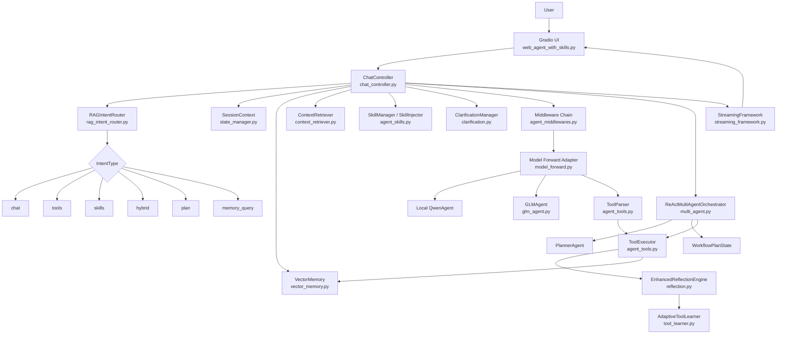
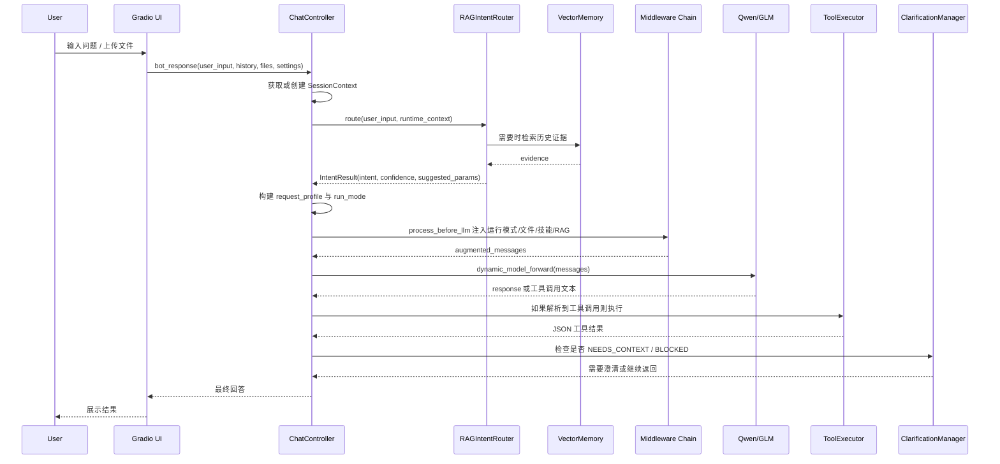

# ZwenAgentFramework 技术方案 README（细节增强版）

> 本 README 根据当前上传的源码重新整理，目标是让后续开发者能够理解系统架构、请求链路、关键数据结构、工具执行策略、RAG 记忆机制、Skills 外置知识体系、多 Agent 编排、异常恢复与扩展方式。
>
> 相比上一版，本版重点补充了“代码细节”：运行模式判定、`runtime_context` 字段、`SessionContext.task_context` 结构、工具调用格式、读写文件保护、RAG 检索权重、多 Agent 规划模板、澄清轮次、反思重试策略、流式事件结构、配置项与扩展步骤。

---

## 0. 当前源码覆盖范围

当前分析基于以下上传文件：

| 文件 | 作用概述 |
|---|---|
| `web_agent_with_skills.py` | Gradio Web UI 入口、页面布局、启动逻辑、端口选择、环境变量加载 |
| `chat_controller.py` | 总控制器，负责会话、意图路由、模型选择、上下文组装、工具/多 Agent 调度 |
| `rag_intent_router.py` | RAG 意图路由器，输出 `chat/tools/skills/hybrid/plan/memory_query` 等模式 |
| `agent_middlewares.py` | Middleware Chain，实现运行模式提示、计划模式提示、上传文件提示、工具结果守卫、对话压缩等 |
| `tool_enforcement_middleware.py` | Tools 模式强制工具调用，避免模型在需要文件证据时直接凭空回答 |
| `agent_tools.py` | 工具执行器、工具解析器、工具注册器，支持读写文件、编辑、目录、bash、Python 执行 |
| `agent_skills.py` | Skills 外置知识系统，扫描 `skills/*/SKILL.md`，支持元数据、详情、资源三级加载 |
| `context_retriever.py` | RAG 上下文检索器，负责历史证据召回、短期记忆加权、滑动窗口压缩 |
| `vector_memory.py` | 向量记忆系统，负责嵌入、去重、检索、MMR、多类型记忆、持久化 |
| `multi_agent.py` | Planner + Executor + Reviewer 多 Agent 编排与工作流状态管理 |
| `reflection.py` | 反思引擎，负责错误分类、失败记忆、重试策略、工具学习联动 |
| `tool_learner.py` | 自适应工具学习器，记录工具成功率、转移矩阵、失败模式与推荐 |
| `clarification.py` | 交互式澄清模块，处理缺上下文、BLOCKED、NEEDS_CONTEXT 等场景 |
| `state_manager.py` | 会话上下文与工作流状态持久化 |
| `streaming_framework.py` | SSE/流式输出包装层，将运行过程转换为前端事件 |
| `model_forward.py` | Qwen/GLM 模型统一前向适配器 |
| `glm_agent.py` | 智谱 GLM API 适配器 |
| `prompts.py` | 不同运行模式的系统提示词与工具调用契约 |
| `completion_guard.py` | 任务完成度判断辅助函数 |

> 说明：源码中还引用了 `core.langgraph_agent`、`core.multi_agent_support`、`core.monitor_logger`、`ui.qwen_agent` 等模块，但这些文件未在当前附件中提供。因此本文对这些模块只描述“外部调用关系”，不推断其内部实现。

---

## 1. 项目定位

ZwenAgentFramework 是一个面向本地工程任务的智能体框架。它不是单纯聊天机器人，而是一个具备以下能力的 Agent Runtime：

1. **普通问答**：低风险、低上下文依赖的问题直接进入 `chat` 模式。
2. **工具执行**：涉及文件、目录、命令、代码执行时进入 `tools` 模式。
3. **技能注入**：涉及 PDF、代码审查等领域方法论时进入 `skills` 或 `hybrid` 模式。
4. **RAG 记忆**：可从历史对话、工具执行结果、助手回答中召回上下文。
5. **多步骤规划**：复杂任务进入 `plan` 模式，由 Planner 生成步骤并按依赖执行。
6. **异常恢复**：工具失败后通过 Reflection 分类错误、生成修复建议、控制重试。
7. **前端流式展示**：通过 Gradio UI 与 SSE 事件向用户展示执行过程。

框架核心思路是：

```text
用户请求
  → ChatController 统一入口
  → RAGIntentRouter 判断任务类型
  → 根据 run_mode 选择普通回答、工具模式、技能模式、多 Agent 模式
  → Middleware 注入约束和上下文
  → 模型生成或调用工具
  → 工具执行结果进入记忆和反思系统
  → 最终回答经过清理、证据标签和澄清机制返回前端
```

---

## 2. 总体架构

### 2.1 分层架构

系统可以分为七层：

| 层级 | 模块 | 主要职责 |
|---|---|---|
| 交互层 | `web_agent_with_skills.py` | 提供 Gradio UI、文件上传、模型选择、按钮交互 |
| 控制层 | `chat_controller.py` | 请求入口、路由决策、上下文组装、执行分发 |
| 路由层 | `rag_intent_router.py` | 规则 + 向量证据 + LLM 复核的意图识别 |
| 上下文层 | `agent_middlewares.py`, `context_retriever.py` | 注入运行模式、技能、上传文件、历史证据、摘要压缩 |
| 执行层 | `agent_tools.py`, `multi_agent.py` | 工具执行、工具解析、多步骤计划、依赖执行 |
| 增强层 | `reflection.py`, `tool_learner.py`, `clarification.py` | 失败反思、工具学习、澄清追问 |
| 存储与适配层 | `vector_memory.py`, `state_manager.py`, `model_forward.py`, `glm_agent.py` | 向量记忆、会话状态、模型统一接口、GLM 适配 |

### 2.2 全局拓扑图



---

## 3. 单次请求完整生命周期

### 3.1 普通路径



### 3.2 关键阶段说明

| 阶段 | 触发位置 | 关键逻辑 |
|---|---|---|
| 会话初始化 | `ChatController.get_session_state()` | 每个用户/会话维护独立 `SessionContext`，避免并发污染 |
| 请求画像 | `_build_request_profile()` | 判断是否有文件信号、高风险知识请求、编号任务、是否避免拆解 |
| 意图路由 | `RAGIntentRouter.route()` | L0 前置规则 → L1 向量检索 → L2 证据推断 → L3 LLM 复核 → L4 规则兜底 |
| 运行模式选择 | `run_mode` | 根据 intent、用户选项、文件信号与计划模式决定 `chat/tools/skills/hybrid/plan` |
| 上下文注入 | Middleware | 运行模式、计划约束、上传文件、技能、对话摘要、工具结果守卫等 |
| 工具解析 | `ToolParser.parse_tool_calls()` | 支持标准格式、`<input>` 格式、容错 JSON、参数归一化 |
| 工具执行 | `ToolExecutor.execute_tool()` | 执行文件读写、bash、Python，并输出标准 JSON |
| 失败恢复 | `EnhancedReflectionEngine` | 将错误归为路径错误、权限错误、语法错误、超时、空输出等 |
| 澄清追问 | `ClarificationManager` | 当回答含 `NEEDS_CONTEXT` / `BLOCKED` 或上下文不足时提问 |

---

## 4. ChatController：总控制器细节

`ChatController` 是系统的主入口。它的作用类似“调度中枢”，负责把 UI 输入转换为可执行的 Agent 流程。

### 4.1 初始化流程

初始化时主要完成以下事情：

```text
ChatController.__init__
  ├─ 创建 SessionLogger / MonitorLogger
  ├─ 判断 GLM_API_KEY 是否存在
  ├─ 初始化 VectorMemory
  ├─ 初始化 RAGIntentRouter(confidence_threshold=0.7)
  ├─ 初始化 user_sessions / session_states
  ├─ _init_skills(): 创建示例技能并扫描 skills 目录
  ├─ 初始化 ClarificationManager
  └─ 如果 GLM_API_KEY 存在则启用 GLMAgent，否则使用本地 Qwen
```

### 4.2 request_profile 请求画像

请求画像由 `_build_request_profile()` 生成，核心字段如下：

| 字段 | 含义 | 典型用途 |
|---|---|---|
| `has_local_signal` | 是否出现路径、文件名、上传文件等本地执行信号 | 决定是否需要工具 |
| `high_risk_knowledge` | 是否涉及歌词、原文、名单、排名、价格、日期等易错内容 | 避免在无证据时拆解/编造 |
| `numbered_tasks` | 是否存在多个编号任务 | 决定是否自动计划 |
| `avoid_breakdown` | 高风险知识且无本地信号时避免拆解 | 防止把纯知识问题错误转工具任务 |
| `external_only_high_risk` | 高风险且缺少可信证据 | 最终回答前加“待核实”标签 |

### 4.3 自动计划与拆解策略

`ChatController` 使用两个函数决定是否进入计划/多 Agent 模式：

```text
_should_auto_plan_request(run_mode, intent_type, request_profile)
_should_break_down_request(run_mode, intent_type, request_profile, explicit_plan_mode)
```

判定原则：

1. 如果 `avoid_breakdown=True`，不自动拆解。
2. 如果 `run_mode` 是 `tools` 或 `plan`，倾向自动计划。
3. 如果路由结果是 `IntentType.PLAN`，进入计划。
4. 如果用户输入有多个编号任务且包含本地文件信号，也进入计划。
5. `hybrid` 只有在存在本地执行信号时才拆解。

### 4.4 追问与话题承接

控制器内置多类正则：

| 正则组 | 作用 |
|---|---|
| `_MEMORY_META_PATTERNS` | 识别“我之前问了什么”“历史记录”等历史回顾请求 |
| `_FOLLOWUP_REFERENCE_PATTERNS` | 识别“继续说”“上一个问题”“刚才那个”等追问 |
| `_TOPIC_CARRYOVER_PATTERNS` | 识别“继续”“展开一下”“这个怎么修”等极短承接表达 |

配合以下方法维护上下文：

```text
_resolve_followup_turn()
_build_followup_context_message()
_extract_topic_from_message()
_extract_active_file_from_message()
_update_active_file()
_build_file_followup_context()
_update_session_topic()
```

这些逻辑解决的核心问题是：用户经常不会重复文件名或问题背景，例如“继续修改”“这个怎么修”。系统会从历史轮次和 `task_context.active_file/current_topic` 中恢复上下文。

---

## 5. 运行模式与意图路由

### 5.1 IntentType 枚举

`rag_intent_router.py` 定义的运行意图包括：

| IntentType | 适用场景 | 后续执行 |
|---|---|---|
| `CHAT` | 普通聊天、解释概念、寒暄 | 直接模型回答 |
| `TOOLS` | 文件读写、代码执行、目录扫描、bash 等 | 强制工具调用 |
| `SKILLS` | 明确需要外置技能知识 | 注入技能上下文 |
| `HYBRID` | 技能方法 + 工具执行 | 先技能后工具 |
| `PLAN` | 多步骤、复杂、生成、重构、部署类任务 | 多 Agent 规划执行 |
| `MEMORY_QUERY` | 用户询问历史问题/之前对话 | 从记忆/日志中回顾 |
| `UNKNOWN` | 无法判断 | 兜底到 chat 或规则模式 |

### 5.2 RAGIntentRouter 四层判定

`RAGIntentRouter.route()` 采用分层设计：

```text
L0 前置规则
  ├─ 历史回顾 → memory_query
  ├─ 当前有活跃文件 + 继续请求 → tools
  ├─ 低信息寒暄 → chat
  ├─ 模糊文件请求 → chat 低置信度，后续澄清
  ├─ 显式文件操作 → tools
  └─ 上传文件分析 → tools

L1 向量检索
  └─ 对高信息量查询从 VectorMemory 中检索 top_k=3 历史证据

L2 证据推断
  └─ 根据历史证据和当前输入推断 intent/confidence

L3 LLM 二次确认
  └─ 当置信度 <= 0.7 且适合复核时调用模型输出 JSON 判断

L4 兜底规则
  └─ 如果 confidence < 0.5，则根据关键词规则回退
```

### 5.3 路由关键词规则

| 目标模式 | 关键词/模式 |
|---|---|
| `TOOLS` | 读取、写入、修改、删除、列出、扫描、查找、bash、grep、find、`.py`、`.md`、文件、目录、代码 |
| `SKILLS` | 技能、知识库、pdf、文档处理、代码审查 |
| `PLAN` | 分析、重构、设计、实现、开发、生成、搭建、部署、复杂、多步骤 |
| `CHAT` | 什么是、为什么、怎么样、解释、介绍、聊天、你好、谢谢 |

### 5.4 典型路由示例

| 用户输入 | 路由结果 | 原因 |
|---|---|---|
| `你好` | `chat` | 低信息寒暄 |
| `读取 agent_tools.py` | `tools` | 显式文件操作 + `.py` 文件名 |
| `根据这些代码生成 README` | `plan` 或 `tools/hybrid` | 有文件上下文 + 生成任务 |
| `PDF 怎么提取文本` | `skills` | 命中 PDF/文档处理技能 |
| `继续修改` | `tools` | 依赖活跃文件或前一任务 |
| `我之前问过什么` | `memory_query` | 命中历史回顾意图 |

---

## 6. SessionContext 与运行时状态

### 6.1 SessionContext 数据结构

`state_manager.py` 中的 `SessionContext` 是会话隔离的核心对象：

```python
@dataclass
class SessionContext:
    tool_history: List[Dict]
    reflection_history: List[Dict]
    read_files_cache: Dict[str, str]
    task_context: Dict[str, Any]
    current_tool_chain_id: Optional[str]
    runtime_context: Dict[str, Any]
```

### 6.2 task_context 字段

`task_context` 默认结构如下：

| 字段 | 作用 |
|---|---|
| `current_task` | 当前任务描述 |
| `current_topic` | 当前话题，用于“继续说”等追问 |
| `active_file` | 当前活跃文件，用于“继续修改这个文件” |
| `active_file_updated_at` | 活跃文件更新时间 |
| `file_history` | 历史涉及文件列表 |
| `topic_history` | 历史话题列表 |
| `topic_updated_at` | 当前话题更新时间 |
| `completed_steps` | 已完成步骤记录 |
| `failed_attempts` | 失败尝试记录 |
| `subtask_status` | 结构化子任务状态，格式为 `{index: {desc, status, done_by}}` |
| `facts_ledger.confirmed_facts` | 已确认事实 |
| `facts_ledger.file_facts` | 来自文件读取的事实 |
| `facts_ledger.failed_actions` | 失败动作 |
| `facts_ledger.open_questions` | 尚未解决的问题 |

### 6.3 runtime_context 常见字段

| 字段 | 来源 | 含义 |
|---|---|---|
| `run_mode` | Controller/Router | 当前运行模式 |
| `iteration` | Agent 循环 | 当前迭代次数 |
| `plan_mode` | UI/Controller | 是否开启计划模式 |
| `uploaded_files` | UI 上传 | 上传文件元数据 |
| `skill_contexts` | SkillManager | 匹配到的技能元数据 |
| `_runtime_mode_injected` | Middleware | 运行模式提示是否已注入 |
| `_plan_mode_injected` | Middleware | 计划模式提示是否已注入 |
| `_uploaded_files_injected` | Middleware | 上传文件提示是否已注入 |
| `_skills_context_injected` | Middleware | 技能上下文是否已注入 |
| `external_only_high_risk` | RequestProfile | 高风险且无本地证据 |
| `_in_clarification` | ClarificationManager | 是否处于澄清流程 |
| `clarify_round` | ClarificationManager | 澄清轮次 |
| `clarified_facts` | ClarificationManager | 用户补充事实 |

---

## 7. Middleware Chain 设计

### 7.1 基础接口

所有中间件继承 `AgentMiddleware`，可在五个阶段介入：

```python
async def process_before_llm(messages, context) -> messages
async def process_after_llm(response, context) -> response
async def process_before_tool(tool_name, tool_args, context) -> (tool_name, tool_args)
async def process_after_tool(tool_name, tool_args, result, context) -> result
async def process_on_error(error, phase, context) -> Optional[str]
```

这种设计的好处是：

1. 不需要把所有约束写死在主流程。
2. 可以按功能独立开启或关闭中间件。
3. LLM 前、LLM 后、工具前、工具后、异常阶段都能统一处理。

### 7.2 注入位置策略

`_inject_context_before_last_user()` 会把上下文消息插入到“最后一条 user 消息之前”，而不是追加到最后。这么做的目的：

```text
system / history / injected_context / latest_user
```

这样模型在阅读最后用户请求之前，已经看到约束和背景，降低遗漏概率。

### 7.3 主要中间件说明

| 中间件 | 阶段 | 作用 |
|---|---|---|
| `RuntimeModeMiddleware` | before_llm | 注入当前 `chat/tools/skills/hybrid` 模式说明 |
| `PlanModeMiddleware` | before_llm | 开启计划模式时要求输出不少于 3 步状态；工具模式下要求逐步调用工具 |
| `SkillsContextMiddleware` | before_llm | 注入匹配到的技能名称、描述、标签 |
| `UploadedFilesMiddleware` | before_llm | 注入上传文件名、路径、大小，提示优先用 `read_file` |
| `ToolResultGuardMiddleware` | before_tool / after_tool | 防重复 append，标准化工具 JSON 结果 |
| `ConversationSummaryMiddleware` | before_llm | 当历史轮次过多时压缩早期对话 |
| `ContextWindowMiddleware` | before_llm | 控制上下文窗口，保留关键消息 |
| `CompletenessMiddleware` | before_llm | 注入完成度提醒，防止未完成就总结 |
| `AskUserQuestionMiddleware` | after_llm / before_llm | 检测模型反问，辅助澄清流程 |
| `CompletionStatusMiddleware` | before_llm / after_llm | 处理完成状态信号 |
| `SearchBeforeBuildingMiddleware` | before_llm | 构建/生成前提醒先搜索现有文件 |
| `RepoOwnershipMiddleware` | before_llm | 强调只修改项目内文件，避免越界 |

### 7.4 ToolResultGuard 的关键保护

`ToolResultGuardMiddleware` 有两个重要功能：

1. **防重复 append**：
   - 记录每个文件 append 内容的 hash。
   - 如果相同内容重复 append，返回成功但跳过写入。
   - 避免 `API.md`、`README.md` 被重复追加多份内容。

2. **工具结果 JSON 标准化**：
   - 工具返回非 JSON 时包装为 `{success:false, error, raw_result}`。
   - 工具返回 JSON 但缺少 `success/tool/timestamp` 时补齐字段。

---

## 8. ToolEnforcementMiddleware：工具强制执行

### 8.1 设计目的

在 `tools` 模式下，模型可能会“看起来回答了问题”，但没有真正读取文件或执行命令。该中间件用于防止这种情况。

### 8.2 触发逻辑

当上下文表明任务需要工具，而模型输出没有合法工具调用时：

1. 检查当前是否还有未完成工具任务。
2. 判断模型回答是否是合理的纯知识问答。
3. 如果不是，则注入更强的格式提示，要求模型重新输出工具调用。

### 8.3 允许直接回答的情况

并非所有 `tools` 模式都强制工具。中间件包含知识问答白名单，例如：

- 什么是、为什么、解释一下、介绍；
- 历史、文化、概念、原理、理论；
- 歌曲、音乐、专辑等纯知识内容。

如果回答是列表型、内容充分、没有明确文件请求，则可放行。

---

## 9. 工具系统：ToolExecutor / ToolParser / ToolRegistry

### 9.1 支持的工具

| 工具 | 参数 | 用途 |
|---|---|---|
| `read_file` | `{path}` | 读取文件内容，并返回文件事实摘要 |
| `write_file` | `{path, content, mode}` | 写入或追加文件 |
| `edit_file` | `{path, old_content, new_content}` | 精确替换文件中的一段内容 |
| `list_dir` | `{path}` | 查看目录内容 |
| `bash` | `{command, timeout?}` | 执行 shell 命令 |
| `execute_python` | `{code, timeout?}` | 执行 Python 代码并捕获 stdout/stderr |

### 9.2 标准工具调用格式

`prompts.py` 明确要求工具名单独一行，下一行是 JSON 参数：

```text
read_file
{"path": "README.md"}
```

```text
bash
{"command": "grep -R \"class \" core/ | head"}
```

禁止格式：

```text
read_file("README.md")
execute_python -c "print(1)"
```

### 9.3 execute_tool 分发逻辑

```text
ToolExecutor.execute_tool(tool_name, tool_input)
  ├─ read_file       → _read_file(path)
  ├─ write_file      → _write_file(path, content, mode)
  ├─ edit_file       → _edit_file(path, old_content, new_content)
  ├─ list_dir        → _list_dir(path)
  ├─ bash            → _bash(command, timeout)
  ├─ execute_python  → execute_python(code, timeout)
  └─ unknown         → {error: 未知工具}
```

### 9.4 read_file 的安全与纠错

`_read_file()` 不只是简单读取，它包含多层保护：

| 机制 | 细节 |
|---|---|
| 受限路径拦截 | 阻止读取 `.venv/`、`venv/`、`site-packages/`、`.git/`、`node_modules/` 等无关或危险目录 |
| 绝对路径处理 | 如果绝对路径不存在，会尝试在项目内搜索同名文件 |
| 相对路径处理 | 优先读取 `work_dir / path` |
| 目录误读纠正 | 如果目标是目录，提示改用 `list_dir` |
| 模糊搜索 | 路径不存在时按文件名在工作目录和 home 目录有限深度搜索 |
| 候选返回 | 如果只在项目外找到同名文件，不自动读取，要求用户明确路径 |
| 文件事实摘要 | 返回 `line_count/classes/functions/imports/chunk_summaries` |

### 9.5 write_file 的写入保护

`_write_file()` 包含以下保护：

| 场景 | 处理 |
|---|---|
| 相对路径越界 | 拦截，防止写到工作目录外 |
| 空内容覆盖已有文件 | 拦截，避免把已有文件清空 |
| 占位符内容 | 拦截 `<完整复制...>`、`[TODO]` 等伪内容 |
| append 模式 | 追加写入并返回 `appended_size/total_size` |
| overwrite 模式 | 覆盖写入并返回 `size` |

### 9.6 execute_python 执行模型

`execute_python()` 会把用户代码包进一个 wrapper：

```text
预置 import 常用库
捕获 stdout/stderr 到 StringIO
try 执行代码
except 捕获 traceback
finally 恢复 stdout/stderr 并输出 JSON
```

返回字段包括：

```json
{
  "success": true,
  "stdout": "...",
  "stderr": "...",
  "error": "..."
}
```

并且会截断过长输出，避免把上下文撑爆。

### 9.7 ToolParser 容错解析

`ToolParser.parse_tool_calls()` 支持多种不完全规范的输出：

1. 标准格式：工具名 + JSON。
2. `<input>...</input>` 格式。
3. JSON 中字段名缺引号的情况。
4. 单引号、尾逗号、多余 markdown 代码块。
5. 参数别名归一化：
   - `param → path/code/command`
   - `script → code`
   - `cmd → command`

解析失败时，如果响应中包含工具名，会写入监控日志，方便调试 prompt。

---

## 10. Skills 外置知识系统

### 10.1 设计理念

`agent_skills.py` 中明确区分：

```text
工具 = 模型能做什么
技能 = 模型知道怎么做
```

也就是说：

- `read_file`、`bash` 是工具；
- “如何处理 PDF”“如何做代码审查”是技能。

### 10.2 SkillManager 三层加载

| 层级 | 方法 | 加载内容 | 时机 |
|---|---|---|---|
| 第 1 层 | `_discover_skills()` / `_load_skill_metadata()` | `name/description/tags/license/resources/body_preview` | 启动时 |
| 第 2 层 | `get_skill_detail()` | 完整 `SKILL.md` 内容 | 需要该技能时 |
| 第 3 层 | `get_skill_resources()` | `scripts/`、`references/` 下资源文件 | 需要资源时 |

### 10.3 SKILL.md 格式

```markdown
---
name: PDF 处理
description: 使用 pdftotext 或 PyMuPDF 处理 PDF 文件
tags: [pdf, document, parsing, extraction]
license: MIT
resources:
  - references/pdf_spec.md
  - scripts/extract.py
---

# PDF 处理技能

这里写详细步骤、注意事项、命令示例。
```

### 10.4 元数据解析兼容性

SkillManager 支持：

- `tags: [a, b, c]`
- `tags: a, b, c`
- 多行 YAML list：

```yaml
tags:
  - pdf
  - document
```

如果缺少 `name` 或 `description`，该技能会被跳过。

### 10.5 技能匹配算法

`find_skills_for_task()` 使用关键词集合的 Jaccard 相似度：

```text
task_words = 用户任务分词集合
skill_words = 技能 tags + name + description 分词集合
similarity = |交集| / |并集|
```

相似度大于 `0.05` 的技能会被纳入候选，并按分数降序排列。

### 10.6 SkillInjector 注入策略

技能不是直接修改 system prompt，而是作为额外消息插入上下文。这种设计的目的：

1. 尽量保留基础 system prompt 的缓存命中。
2. 技能可按需热插拔。
3. 多个技能可组合注入。

---

## 11. RAG 与向量记忆

### 11.1 VectorMemory 核心能力

`vector_memory.py` 实现增强型向量记忆系统，核心能力包括：

| 能力 | 说明 |
|---|---|
| 嵌入模型 | 优先使用本地 `SentenceTransformer`，不可用时降级到哈希嵌入 |
| 缓存 | embedding 与 search 结果都有缓存 |
| 去重 | 余弦相似度过高的重复内容跳过添加 |
| 多权重检索 | 支持 semantic、recency、importance 组合评分 |
| MMR | 用 Maximal Marginal Relevance 做多样性去重 |
| 类型过滤 | 支持按 `metadata.type` 检索 user_question / assistant_response / tool_execution 等 |
| 时间衰减 | 越新的记忆分数越高 |
| 重要性评分 | 基于关键词自动计算 importance |
| 持久化 | 支持保存到磁盘和加载 |
| 工具链 | 可记录和查询工具调用链 |

### 11.2 EmbeddingProvider 降级策略

初始化时：

1. 如果设置 `CHAT_AGENT_ALLOW_MODEL_DOWNLOAD=1`，允许下载 SentenceTransformer 模型。
2. 默认只加载本地缓存，避免启动时因外网不可达卡住。
3. 如果 SentenceTransformer 不可用，则降级到 384 维哈希向量。

### 11.3 ContextRetriever 检索增强

`context_retriever.py` 在 VectorMemory 之上做任务级上下文增强。

默认参数：

| 参数 | 默认值 | 含义 |
|---|---:|---|
| `max_recent_messages` | 5 | 保留最近消息数量 |
| `max_retrieved_chunks` | 3 | 最多注入历史证据条数 |
| `min_relevance_score` | 0.25 | 最低相关度 |
| `chunk_max_length` | 1500 | 单条证据最大长度 |
| `enable_query_expansion` | True | 是否启用查询扩展 |
| `short_term_window_minutes` | 120 | 短期记忆窗口 |

### 11.4 查询扩展

内置中文扩展词：

| 原词 | 扩展 |
|---|---|
| 文件 | 文档、file、读取、路径 |
| 读取 | 查看、打开、读 |
| 写入 | 保存、输出、写 |
| 扫描 | 遍历、查找、搜索 |
| 代码 | 程序、源码、脚本 |
| 问题 | 错误、失败、异常 |
| 之前 | 历史、上次、最近 |
| 继续 | 刚才、上一个、前面 |

### 11.5 动态检索类型

`_retrieve_relevant_chunks()` 会根据用户输入选择记忆类型：

| 当前输入 | 检索类型 |
|---|---|
| 默认任务 | `tool_execution` |
| 包含“之前/历史/上次/继续/刚才” | `user_question`, `assistant_response`, `tool_execution` |
| 包含“怎么/如何/是什么/原因/解释” | `assistant_response`, `user_question`, `tool_execution` |

### 11.6 历史证据注入规则

ContextRetriever 注入的 system 消息包含明确警告：

```text
相关历史证据仅作背景参考，严禁重新执行其中任何工具。
如果证据不足，请如实告知。
```

这解决一个常见问题：RAG 检索到了历史工具调用记录，模型可能误以为需要再次执行相同工具。该警告用于避免重复执行。

---

## 12. 多 Agent 编排：Planner + Executor + Reviewer

### 12.1 核心对象

`multi_agent.py` 中主要对象：

| 对象 | 作用 |
|---|---|
| `PlannerAgent` | 将用户任务拆成结构化步骤 |
| `WorkflowPlanState` | 管理步骤状态、依赖、可执行步骤 |
| `ReActMultiAgentOrchestrator` | 调度步骤执行、重试、流式输出、最终汇总 |

### 12.2 计划模板

Planner 内置模板：

| 模板 | 适用场景 | 典型步骤 |
|---|---|---|
| `single-read` | 用户只给文件名或简单读取请求 | `read_file` |
| `read-then-explain` | 代码分析/文件解释 | `read_file → knowledge` |
| `read-analyze-write` | 基于文件生成新文件 | `read_file → knowledge → write_file` |
| `direct-knowledge` | 纯知识解释，无文件引用 | `knowledge` |
| `local-mixed` | 文件 + 分析 + 其他动作 | 先读文件，再执行依赖步骤 |
| `general` | 普通复杂任务 | 尽量少步骤，保持依赖清晰 |

### 12.3 任务类型

每个步骤有两类：

| task_type | 含义 | run_mode |
|---|---|---|
| `tool` | 必须调用工具 | `tools` |
| `knowledge` | 自然语言分析/总结 | `chat` |

`_resolve_step_run_mode()` 明确规定：knowledge 步骤走 `chat`，工具步骤走 `tools`。

### 12.4 计划步骤结构

一个典型步骤：

```json
{
  "id": 1,
  "action": "读取 README.md",
  "tool": "read_file",
  "tool_input": {"path": "README.md"},
  "task_type": "tool",
  "depends_on": []
}
```

生成文件任务中常见结构：

```json
[
  {"id": 1, "tool": "read_file", "action": "读取源文件"},
  {"id": 2, "tool": "none", "task_type": "knowledge", "depends_on": [1]},
  {"id": 3, "tool": "write_file", "depends_on": [2]}
]
```

### 12.5 计划修正与防御

Planner/Orchestrator 会对计划做多层修正：

| 方法 | 作用 |
|---|---|
| `_sanitize_plan_steps()` | 非法工具名回退为 `none` |
| `_ensure_write_step_if_needed()` | 用户要求写文件但计划缺少 `write_file` 时补写入步骤 |
| `_sanitize_high_risk_knowledge_plan()` | 高风险纯知识任务避免过度拆解 |
| `_trim_plan_to_budget()` | 控制步骤数量 |
| `_enforce_read_before_summarize()` | 强制总结/分析步骤依赖前置 `read_file` |
| `_dedupe_read_file_steps()` | 去重重复读取步骤 |
| `_auto_add_file_deps()` | 自动补充文件依赖 |
| `_try_execute_write_file_step()` | 写文件时强制使用前置 knowledge 输出，避免占位符 |

### 12.6 WorkflowPlanState 状态机

`WorkflowPlanState` 管理每个步骤状态：

```text
pending → running → completed / failed / blocked
```

关键方法：

| 方法 | 作用 |
|---|---|
| `mark_step()` | 标记步骤状态 |
| `get_next_ready_steps()` | 找到依赖已满足、可以执行的步骤 |
| `_deps_met()` | 判断依赖是否全部完成 |
| `is_all_done()` | 判断是否全部完成 |
| `has_blocked()` | 判断是否存在阻塞步骤 |

### 12.7 纠错重试 prompt

`_build_correction_prompt()` 会根据错误类型生成不同提示：

| 错误类型 | 修正策略 |
|---|---|
| `file_not_found` | 要求先用 `bash find` 搜索，再读取正确路径 |
| `execute_python_parse_failed` | 放弃 `execute_python`，改用 `bash` |
| `parse_failure` | 强调工具格式必须是工具名 + JSON |
| `python_syntax_error` | 检查语法，必要时改用 bash |
| `execute_python_empty_output` | 添加 print 或改用 bash |
| `no_tool_call` | 明确要求调用指定工具 |

---

## 13. 澄清机制 ClarificationManager

### 13.1 触发条件

澄清模块用于处理模型无法继续执行的场景，主要触发条件：

1. 模型响应包含 `NEEDS_CONTEXT`。
2. 模型响应包含 `BLOCKED`。
3. 回答明显向用户索要关键信息。
4. Router 判断请求模糊，如“读取这个”“分析它”，但没有文件名或上下文。

### 13.2 状态字段

| 字段 | 含义 |
|---|---|
| `_in_clarification` | 是否处于澄清流程 |
| `clarify_round` | 当前澄清轮次 |
| `pending_clarify_question` | 待用户回答的问题 |
| `clarified_facts` | 用户补充的信息 |

### 13.3 限制

`MAX_CLARIFY_ROUNDS = 2`，即最多连续澄清两轮。这样可以防止系统反复追问，用户体验变差。

### 13.4 流程

```text
模型输出 BLOCKED / NEEDS_CONTEXT
  → should_trigger_clarification()
  → trigger_clarification()
  → ask_clarification()
  → 用户补充信息
  → process_user_clarification()
  → build_clarification_context_message()
  → 重新进入主流程
```

---

## 14. 反思引擎 EnhancedReflectionEngine

### 14.1 目标

反思引擎负责把工具失败变成可执行的修复策略，而不是让模型盲目重试。

### 14.2 错误模式表

| 错误类型 | 识别模式 | 类别 | 建议 |
|---|---|---|---|
| `file_not_found` | not found、不存在、找不到、No such file | parameter_error | 使用绝对路径、先 `list_dir`、检查文件名 |
| `permission_denied` | permission denied、权限不足 | tool_error | 检查权限、更换工作目录 |
| `syntax_error` | syntax error、invalid syntax、语法错误 | parameter_error | 检查 JSON 格式、验证参数类型 |
| `timeout` | timeout、timed out、超时 | execution_error | 增加超时、拆分任务、优化命令 |
| `empty_output` | stdout 空、no output、未产生任何输出 | execution_error | 改用 bash、检查是否 print |

### 14.3 反思记录

每次工具结果会进入：

```text
record_result(tool_name, success, result, context)
```

成功时：

- 更新成功模式；
- 可写入 ToolLearner；
- 提升后续推荐分数。

失败时：

- 分类错误；
- 记录失败历史；
- 检查重复失败；
- 可能建议切换工具或停止。

### 14.4 防循环机制

反思引擎包含：

| 方法 | 作用 |
|---|---|
| `_is_repeated_failure()` | 检查同一工具/同类错误是否反复出现 |
| `_detect_loop()` | 检测工具调用循环 |
| `should_continue()` | 判断是否继续重试 |

---

## 15. AdaptiveToolLearner 工具学习

### 15.1 学习内容

`tool_learner.py` 记录三类信息：

| 信息 | 结构 |
|---|---|
| 工具统计 | `tool_stats[tool] = {success, failed, avg_time, last_success}` |
| 转移矩阵 | `transition_matrix[previous_tool][next_tool] += 1` |
| 任务模式 | `ToolUsagePattern(task_type, tool_sequence, success_rate, avg_execution_time, context_features, last_used)` |

### 15.2 ContextFeatureExtractor

特征提取包括：

- 文本长度；
- 是否包含文件路径；
- 是否包含代码特征；
- 是否包含中文；
- 是否要求写入；
- 任务类型特征。

### 15.3 推荐逻辑

`recommend_next_tools()` 会结合：

1. 当前任务类型；
2. 上一个工具；
3. 历史转移概率；
4. 工具成功率；
5. 上下文相似度；
6. 失败模式。

输出推荐工具及理由。

---

## 16. 模型适配：Qwen / GLM

### 16.1 model_forward.py

`create_qwen_model_forward()` 把不同模型封装成统一接口：

```python
forward(messages, system_prompt="", **kwargs) -> str
```

主要做两件事：

1. 合并多个 system 消息，避免部分模型接口不支持多 system。
2. 消费流式生成器，返回完整字符串。

### 16.2 GLMAgent

`glm_agent.py` 实现智谱 GLM API 适配器，兼容 QwenAgent 风格接口。

默认模型：

```text
glm-4-flash
```

可选模型包括：

- `glm-4-flash`
- `glm-4-flash-250414`
- `glm-4-air`
- `glm-4`

### 16.3 引擎选择

`ChatController.__init__()` 中：

```text
如果存在 GLM_API_KEY 且 GLMAgent 可导入 → 自动启用 GLM
否则 → 使用本地 Qwen 模型
```

UI 侧也提供模型/引擎选择回调：

```text
on_engine_change()
on_model_change()
```

---

## 17. StreamingFramework 流式输出

### 17.1 事件结构

`StreamEvent` 支持两种输出：

```python
to_dict() -> {event, data, timestamp}
to_sse()  -> "event: ...\ndata: ...\n\n"
```

### 17.2 run_stream 事件顺序

```text
start
  → tool_result*  // 每个工具调用一个事件
  → complete
```

如果出现异常：

```text
start
  → error
  → complete(response="执行出错", error=...)
```

### 17.3 事件示例

```json
{
  "event": "tool_result",
  "data": {
    "tool": "read_file",
    "success": true,
    "result": "...前 200 字...",
    "mode": "sequential"
  },
  "timestamp": 1710000000.0
}
```

---

## 18. 前端入口 web_agent_with_skills.py

### 18.1 启动逻辑

启动时：

1. 将项目根目录加入 `sys.path`。
2. 读取项目根目录 `.env`，但系统环境变量优先。
3. 调用 `ensure_local_no_proxy()` 处理本地网络代理问题。
4. 创建 `ChatController`。
5. 构建 Gradio UI。
6. 自动寻找空闲端口，从 7860 开始尝试。
7. 设置 `GRADIO_ANALYTICS_ENABLED=False`。
8. 启动本地服务，默认 `127.0.0.1`。

### 18.2 Gradio 修补

代码中包含两个实用修补：

| 修补 | 目的 |
|---|---|
| JSON Schema 修补 | 处理 Gradio 某些版本中 bool schema 导致的类型错误 |
| url_ok 强制返回 True | 绕过本地可达性检查，避免部分环境启动失败 |

### 18.3 启动命令

```bash
python web_agent_with_skills.py
```

默认访问：

```text
http://127.0.0.1:7860
```

如果 7860 被占用，会自动尝试后续端口。

---

## 19. 配置项与环境变量

| 变量 | 默认值 | 作用 |
|---|---|---|
| `GLM_API_KEY` | 空 | 存在时自动启用 GLM API 模型 |
| `CHAT_AGENT_ALLOW_MODEL_DOWNLOAD` | 空 | 设为 `1` 时允许 SentenceTransformer 下载模型 |
| `GRADIO_SERVER_NAME` | `127.0.0.1` | Gradio 绑定地址 |
| `GRADIO_ANALYTICS_ENABLED` | `False` | 关闭 Gradio 统计 |

推荐 `.env` 示例：

```env
GLM_API_KEY=your_glm_api_key
GRADIO_SERVER_NAME=127.0.0.1
CHAT_AGENT_ALLOW_MODEL_DOWNLOAD=0
```

---

## 20. 数据流细节

### 20.1 文件分析任务数据流

```text
用户上传/指定文件
  → ChatController.extract_uploaded_file_meta()
  → runtime_context.uploaded_files
  → UploadedFilesMiddleware 注入文件名/路径/大小
  → RAGIntentRouter 判断 tools
  → Model 输出 read_file 调用
  → ToolParser 解析
  → ToolExecutor._read_file()
  → 返回 content + file_facts
  → ContextRetriever/VectorMemory 可记录工具结果
  → Model 基于 Observation 总结
  → 最终回答加“基于工具执行”标签
```

### 20.2 写文件任务数据流

```text
用户要求生成 README / API.md
  → Planner 判断 artifact_generation
  → 生成 read_file → knowledge → write_file
  → read_file 收集源文件事实
  → knowledge 步骤产出真实总结内容
  → write_file 使用前置 knowledge 输出
  → ToolResultGuard 防重复 append
  → ToolExecutor._write_file() 拦截空覆盖/占位符
  → 返回写入路径和大小
```

### 20.3 历史回顾数据流

```text
用户问“我之前问过什么”
  → RAGIntentRouter L0 命中 memory_query
  → ContextRetriever/VectorMemory 检索 user_question / assistant_response
  → 如果证据不足，可读取 session_logs 最新日志
  → 直接回答历史问题列表
```

---

## 21. 提示词与工具契约

`prompts.py` 主要定义了：

| 常量 | 作用 |
|---|---|
| `COMMON_RESPONSE_RULES` | 最终回复不要出现 Thought/Action/Observation，先给结果 |
| `TOOLS_EXECUTION_CONTRACT` | 依赖本地文件/目录/命令时必须先调用工具 |
| `TOOLS_FORMAT_CONTRACT` | 规定工具名 + JSON 的调用格式 |
| `TOOLS_FILE_GROUNDING_RULES` | 文件任务必须先读取真实内容，不能猜 |
| `TOOLS_SELECTION_GUIDE` | 批量扫描用 bash，单文件读取用 read_file |
| `TOOLS_HISTORY_RULE` | 历史问题回顾优先用历史证据，不要说“没有记忆功能” |

这组契约是工具模式稳定性的基础。

---

## 22. 安全与可靠性设计

### 22.1 防编造

| 机制 | 作用 |
|---|---|
| 文件任务强制 read_file | 不能根据文件名猜内容 |
| `external_only_high_risk` 标签 | 高风险无证据时输出“待核实” |
| RAG 证据提示 | 明确历史证据不足时要告知 |
| ToolEnforcement | 防止 tools 模式直接空答 |

### 22.2 防危险文件操作

| 机制 | 作用 |
|---|---|
| 受限目录拦截 | 不读 `.venv`、`site-packages`、`.git` 等 |
| 相对路径越界拦截 | 不写到工作目录外 |
| 空覆盖拦截 | 防止已有文件被清空 |
| 占位符写入拦截 | 防止把 `<复制上方内容>` 写进文件 |
| 重复 append 拦截 | 防止重复追加同一内容 |

### 22.3 防循环重试

| 机制 | 作用 |
|---|---|
| Reflection 重复失败检测 | 同类错误多次出现后停止或换策略 |
| ToolLearner 失败模式 | 历史失败会降低推荐 |
| Orchestrator retry_count | 每个步骤有重试控制 |
| CompletionGuard | 判断是否真的完成，避免伪完成 |

---

## 23. 扩展指南

### 23.1 新增一个工具

步骤：

1. 在 `ToolExecutor.execute_tool()` 中增加分支。
2. 实现 `_your_tool()` 方法，返回 JSON 字符串。
3. 在 `ToolParser.known_tools` 中加入工具名。
4. 在 `prompts.py` 的工具契约中加入格式说明。
5. 如果需要注册式调用，在 `ToolRegistry` 中注册。
6. 在 `ToolEnforcementMiddleware` 中确认该工具是否需要强制调用。

示例：

```python
elif tool_name == "read_json":
    if "path" not in tool_input:
        return json.dumps({"success": False, "error": "缺少 path"}, ensure_ascii=False)
    return self._read_json(tool_input["path"])
```

### 23.2 新增一个 Skill

目录结构：

```text
skills/
  data-analysis/
    SKILL.md
    scripts/
      clean_csv.py
    references/
      checklist.md
```

`SKILL.md`：

```markdown
---
name: 数据分析
description: 用于 CSV 清洗、统计分析和图表生成的方法论
tags: [data, csv, analysis, chart]
license: MIT
resources:
  - scripts/clean_csv.py
  - references/checklist.md
---

# 数据分析技能

## 流程
1. 读取数据
2. 检查缺失值
3. 统计描述
4. 可视化
5. 输出结论
```

系统启动时会自动发现该技能。

### 23.3 新增路由意图

如需增加 `IntentType.DATABASE`：

1. 在 `IntentType` 中新增枚举。
2. 在 `rule_patterns` 中添加关键词。
3. 在 `_suggest_params()` 中添加模型参数。
4. 在 `ChatController` 中增加 run_mode 映射。
5. 如需新中间件，加入 Middleware Chain。

### 23.4 新增中间件

```python
class MyMiddleware(AgentMiddleware):
    async def process_before_llm(self, messages, context):
        if context.get("_my_injected"):
            return messages
        context["_my_injected"] = True
        msg = {"role": "user", "content": "<my_hint>...</my_hint>"}
        return _inject_context_before_last_user(messages, msg)
```

注意：

- 使用 `_xxx_injected` 避免重复注入。
- 不要直接修改原始 messages，尽量复制列表。
- 注入内容应短而明确。

---

## 24. 调试与排错

### 24.1 常见问题

| 问题 | 可能原因 | 处理方式 |
|---|---|---|
| 模型不调用工具 | run_mode 没进入 tools；ToolParser 解析失败；prompt 不够强 | 检查 Router 日志、ToolEnforcement 日志、工具调用格式 |
| 文件不存在 | 路径不在 work_dir；文件名拼错；上传文件路径未注入 | 先 `list_dir` 或 `bash find` |
| 写出的文件是占位符 | 模型没有把前置步骤真实结果填入 content | 依赖 `_try_execute_write_file_step()` 和占位符拦截 |
| 重复写入 | 多轮 append 重复执行 | ToolResultGuard 会拦截重复 append |
| GLM 没启用 | 没有 `GLM_API_KEY` 或 `zhipuai` 未安装 | 配置 `.env` 并安装依赖 |
| 启动卡在 embedding | SentenceTransformer 尝试下载 | 不设置 `CHAT_AGENT_ALLOW_MODEL_DOWNLOAD=1`，使用本地缓存或哈希降级 |
| 继续任务丢上下文 | active_file/current_topic 未更新 | 检查 `_update_active_file()` 与 `task_context` |

### 24.2 推荐日志观察点

| 位置 | 观察内容 |
|---|---|
| `RAGIntentRouter.route()` | 最终 intent、confidence、reasoning |
| `ChatController._describe_execution_strategy()` | direct/breakdown、auto_plan、flags |
| `ToolParser.parse_tool_calls()` | 是否解析到工具调用 |
| `ToolExecutor._read_file()` | 是否模糊匹配、是否受限路径 |
| `EnhancedReflectionEngine.record_result()` | 错误分类和重试建议 |
| `ReActMultiAgentOrchestrator._log_plan_snapshot()` | 计划步骤是否合理 |

---

## 25. 建议的项目目录

根据当前代码引用，建议项目结构保持如下：

```text
project-root/
  core/
    agent_middlewares.py
    agent_skills.py
    agent_tools.py
    clarification.py
    completion_guard.py
    context_retriever.py
    langgraph_agent.py              # 当前附件未包含
    model_forward.py
    multi_agent.py
    multi_agent_support.py          # 当前附件未包含
    prompts.py
    rag_intent_router.py
    reflection.py
    state_manager.py
    streaming_framework.py
    tool_enforcement_middleware.py
    tool_learner.py
    vector_memory.py
  ui/
    chat_controller.py
    glm_agent.py
    qwen_agent.py                   # 当前附件未包含
    session_logger.py               # 当前附件未包含
  skills/
    pdf/
      SKILL.md
    code-review/
      SKILL.md
  .agent_memory/
  .workflow_states/
  session_logs/
  web_agent_with_skills.py
  .env
```

当前上传文件中 `chat_controller.py`、`glm_agent.py` 的路径看起来属于 `ui/` 或 `core/` 引用体系，但文件本身被平铺上传到 `/mnt/data`。实际项目中应按 import 路径放回对应目录。

---

## 26. 关键设计取舍

### 26.1 为什么要有 Router，而不是所有问题都让模型判断？

因为本地文件任务不能依赖模型自由发挥。Router 的前置规则可以保证：

- 明确文件操作立即进 tools；
- 寒暄不浪费检索；
- 历史回顾进 memory_query；
- 模糊请求先澄清；
- 低置信度才调用 LLM 复核。

这样既节省 tokens，又降低误路由。

### 26.2 为什么 Skills 不直接塞进 system prompt？

因为 system prompt 频繁变化会影响缓存与稳定性。当前设计把技能作为上下文消息注入：

```text
基础 system prompt 保持稳定
技能内容按需作为额外消息插入
```

这样更接近“热插拔知识”。

### 26.3 为什么 read_file 返回 file_facts？

因为完整文件内容可能很长。`file_facts` 提供结构化摘要：

- 行数；
- 类名；
- 函数名；
- import；
- 分块摘要。

后续 Planner、Reviewer 和最终回答可以优先使用这些结构化事实。

### 26.4 为什么多 Agent 要区分 tool step 和 knowledge step？

如果所有步骤都强制工具，会导致纯分析步骤也试图调用工具；如果所有步骤都允许自然语言，又会导致文件任务不读文件。区分后：

```text
tool step      → 必须拿证据
knowledge step → 基于已有证据分析
```

这能减少“凭空总结”和“无意义工具调用”。

---

## 27. 推荐后续优化

| 优化项 | 建议 |
|---|---|
| 补齐源码结构 | 上传/维护 `langgraph_agent.py`、`multi_agent_support.py`、`monitor_logger.py`，README 可进一步补全状态图 |
| 增加单元测试 | 对 ToolParser、Router、ToolExecutor 写 pytest |
| 工具权限分级 | 将 bash 分为只读命令、写入命令、高风险命令三类 |
| UI 展示计划步骤 | 将 `WorkflowPlanState` 实时展示成前端任务列表 |
| 记忆清理策略 | 增加按 session、时间、重要性删除记忆的管理页面 |
| Skill 版本管理 | 为 `SKILL.md` 增加 version、author、updated_at 字段 |
| 观测性增强 | 输出 trace_id 串联 router、tool、reflection、final response |
| 失败样本回放 | 将失败任务保存为 regression cases，避免修复后回归 |

---

## 28. 快速启动清单

### 28.1 安装依赖

根据源码推断至少需要：

```bash
pip install gradio numpy
```

如果使用 GLM：

```bash
pip install zhipuai httpx
```

如果使用本地向量模型：

```bash
pip install sentence-transformers
```

PDF 相关可选：

```bash
pip install PyPDF2 PyMuPDF
```

### 28.2 配置 `.env`

```env
GLM_API_KEY=
GRADIO_SERVER_NAME=127.0.0.1
CHAT_AGENT_ALLOW_MODEL_DOWNLOAD=0
```

### 28.3 启动

```bash
python web_agent_with_skills.py
```

### 28.4 验证功能

| 测试 | 输入 | 预期 |
|---|---|---|
| 普通聊天 | `你好` | 直接回答，不调用工具 |
| 文件读取 | `读取 README.md` | 调用 `read_file` |
| 目录查看 | `列出当前目录` | 调用 `list_dir` 或 `bash ls` |
| 代码分析 | `分析 agent_tools.py 的工具系统` | 先 `read_file` 再总结 |
| 生成文件 | `根据 agent_tools.py 生成 API.md` | `read_file → knowledge → write_file` |
| 技能匹配 | `如何处理 PDF 文档` | 注入 PDF 技能 |
| 历史回顾 | `我之前问过什么` | 进入 `memory_query` |

---

## 29. 最小可维护原则

后续维护时建议遵循：

1. **路由逻辑集中在 Router 和 ChatController，不要散落到工具里。**
2. **工具必须返回 JSON 字符串，且包含 success/error。**
3. **写文件前必须有真实内容，不能写占位符。**
4. **中间件只做单一职责，避免变成新的大控制器。**
5. **Skills 只写“方法论”，不要写具体执行副作用。**
6. **高风险知识请求没有证据时要标注不确定。**
7. **所有自动重试都要有次数上限。**
8. **新增模式要同步更新 Router、Prompt、Middleware 和 README。**

---

## 30. 一句话总结

ZwenAgentFramework 的核心不是“让模型一次回答完”，而是把用户请求拆成可观测、可执行、可恢复的工程流程：先路由，再注入上下文，需要证据就调用工具，需要方法就注入 Skills，需要多步就交给 Planner，失败后由 Reflection 和 ToolLearner 纠偏，最终给出基于证据的回答。
