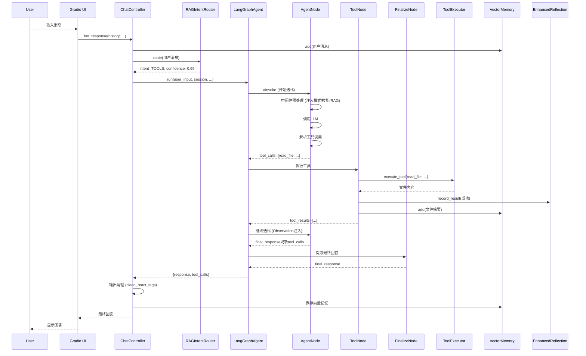
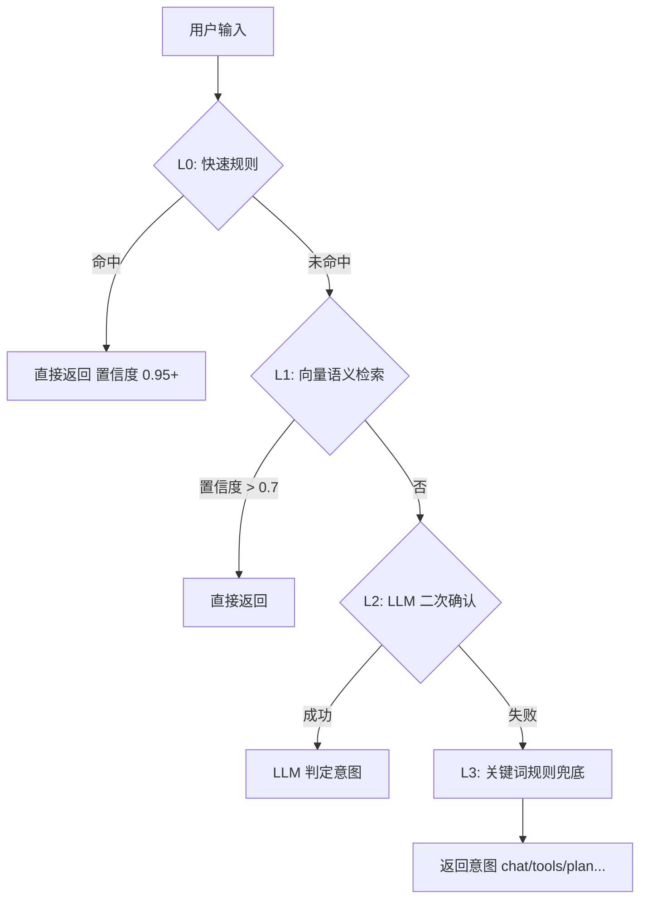
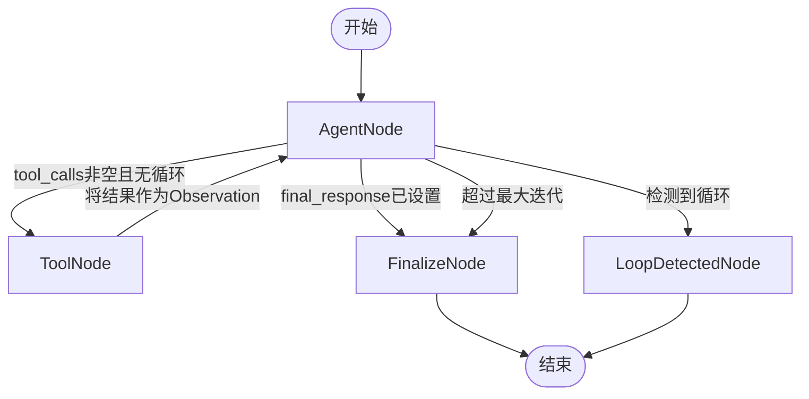
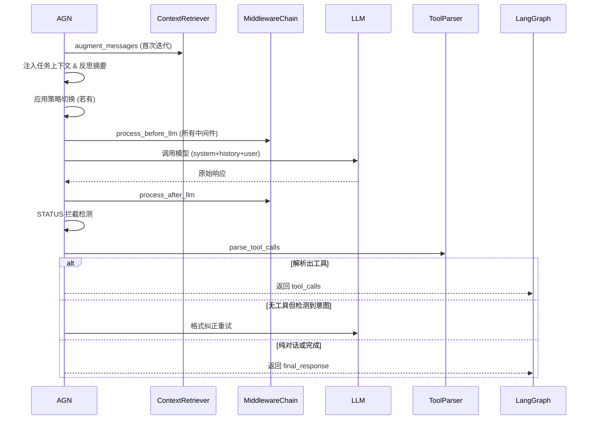
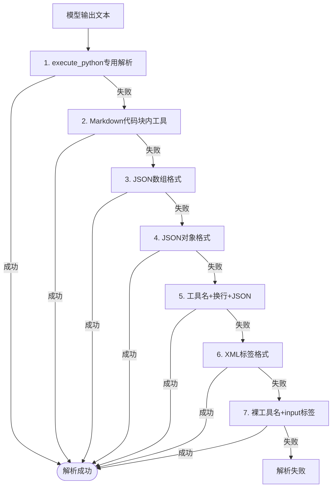
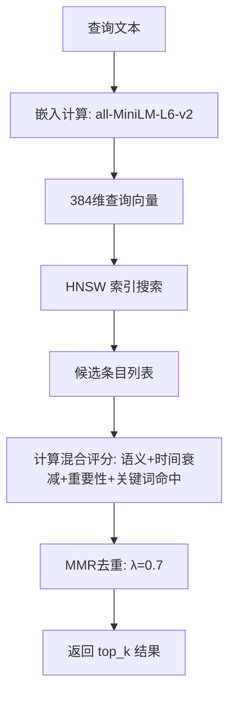
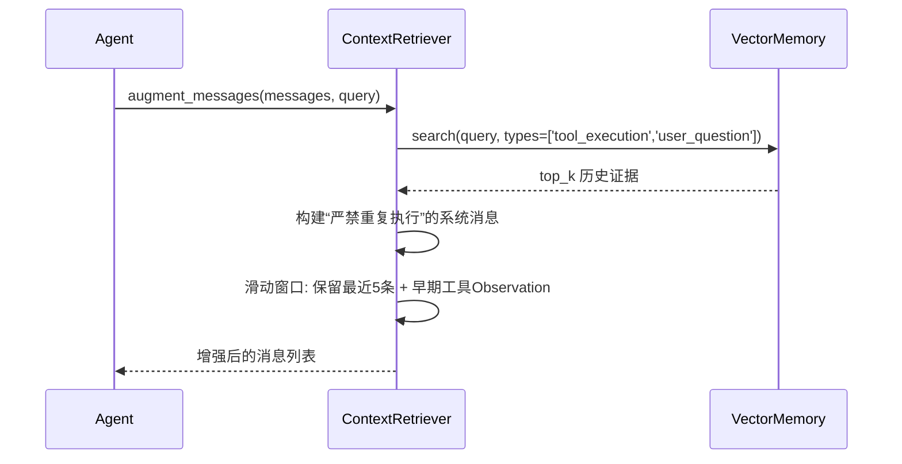
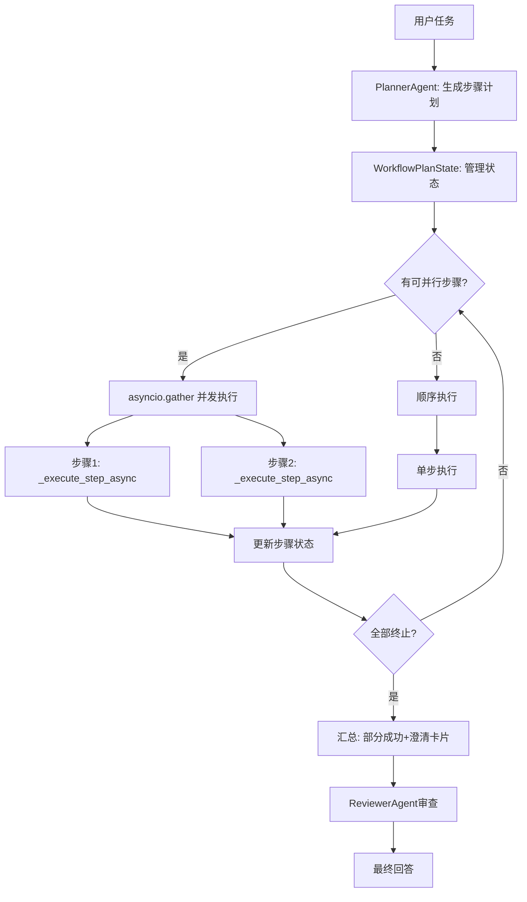

# QwenAgentFramework 技术文档 v3.0  
## 智能体系统的架构、算法与数据流全解析

---

## 1. 系统总览：智能体的“数字城市”

### 1.1 生动比喻
想象一个**高度自治的数字城市**，各组件如同城市中的关键基础设施协同运转：
- **ChatController** = 市政服务大厅（统一窗口，协调所有部门）
- **RAGIntentRouter** = 城市快递分拣中心（三层安检：规则快检 → 历史档案比对 → AI智能复核）
- **LangGraphAgent** = 城市执行中心（LangGraph状态机 = 智能交通指挥中心，支持红灯暂停/绿灯续行）
- **Middleware Chain** = 交通法规系统（12种法规，确保所有车辆按规则行驶）
- **ToolExecutor** = 机械车间（沙箱隔离，危险操作自动拦截）
- **VectorMemory** = 魔法图书馆（按语义而非字母排序，384维空间中的知识星云）
- **ContextRetriever** = 图书检索机器人（RAG增强：自动关联历史证据，但严禁重复执行）
- **ToolLearner** = 老工匠的笔记本（马尔可夫链记录工具转移概率，贝叶斯更新成功率）
- **EnhancedReflectionEngine** = 质量控制局（故障分类 → 重复检测 → 策略升级三级响应）
- **SkillManager** = 专业学院（PDF处理学院、代码审查学院等，热插拔式知识加载）
- **ReActMultiAgentOrchestrator** = 大型工程指挥部（并行调度、依赖管理、断点续跑）
- **ClarificationManager** = 统一客服台（所有澄清路径归一，生成友好提示卡片）
- **SessionLogger / Viewer / Analyzer** = 城市档案馆（三套独立展厅：基础查阅/高级分析/可视化统计）

### 1.2 完整项目结构
```
project_root/
├── core/                           # 核心引擎层
│   ├── langgraph_agent.py         # LangGraph状态图引擎（Checkpoint/断点续跑）
│   ├── agent_middlewares.py       # 中间件链（12种中间件，洋葱模型）
│   ├── agent_tools.py             # 工具系统（执行器/解析器/注册表）
│   ├── vector_memory.py           # 向量记忆（语义嵌入+时间衰减+MMR去重）
│   ├── rag_intent_router.py       # RAG意图路由器（规则+向量+LLM三层）
│   ├── context_retriever.py       # RAG上下文检索器（证据注入+滑动窗口）
│   ├── reflection.py              # 增强反思引擎（错误模式匹配+泊松检验）
│   ├── tool_learner.py            # 自适应工具学习器（马尔可夫转移矩阵）
│   ├── multi_agent.py             # 多Agent协作（Planner-Executor-Reviewer+并行）
│   ├── clarification.py           # 澄清管理器（统一入口、轮次管理）
│   ├── prompts.py                 # 多模式系统提示词（Chat/Tools/Plan/Hybrid）
│   ├── state_manager.py           # 统一状态管理（SessionContext/WorkflowState）
│   ├── monitor_logger.py          # 监控日志（彩色输出/按天轮转/多进程安全）
│   ├── loop_detector.py           # 循环检测（工具签名哈希+thought模式识别）
│   ├── completion_guard.py        # 完成判定守卫（工具关键词+完成信号检测）
│   ├── format_corrector.py        # 格式纠错注入（7种解析策略兜底）
│   ├── output_cleaner.py          # 输出清理（ReAct标签剥离/尾部工具截断）
│   ├── task_injector.py           # 任务上下文注入（事实账本+子任务看板）
│   ├── model_forward.py           # 模型前向工厂（Qwen/GLM统一接口）
│   ├── streaming_framework.py     # 流式SSE包装器（零逻辑重复）
│   └── tool_enforcement_middleware.py  # 工具强制中间件（防偷懒机制）
│
├── ui/                             # Web界面层
│   ├── web_agent_with_skills.py   # 主入口（Gradio豆包风格，侧边栏可收起）
│   ├── chat_controller.py         # 业务控制器（整合所有核心组件）
│   ├── qwen_agent.py              # 本地Qwen2.5-0.5B（CPU模式/流式生成）
│   ├── glm_agent.py               # 智谱GLM-4-Flash API封装（免费/流式）
│   ├── session_viewer.py          # 会话查看器（端口7861）
│   └── session_analyzer.py        # 高级分析（端口7862，JSON编辑/可视化）
│
├── skills/                         # 技能知识库（热插拔LoRA式加载）
│   ├── pdf/SKILL.md
│   ├── code-review/SKILL.md
│   └── python-dev/SKILL.md
├── session_logs/                   # 会话持久化日志（JSON格式）
├── logs/                           # 监控日志（按天轮转，保留30天）
├── checkpoints.db                  # LangGraph检查点数据库（SQLite）
├── .agent_memory/                  # 向量记忆持久化（meta.json + emb.npz）
├── start_all_apps.sh / stop_all_apps.sh
└── README.md
```

### 1.3 架构拓扑图（全局交互）

```mermaid
graph TD
    UI[Gradio UI (7860/7861/7862)] --> Controller[ChatController]
    Controller --> Router[RAGIntentRouter]
    Controller --> SkillMgr[SkillManager]
    Controller --> LangGraph[LangGraphAgent]
    Controller --> MultiAgent[ReActMultiAgentOrchestrator]
    LangGraph --> Middleware[MidwareChain]
    LangGraph --> StateMachine[StateMachine]
    StateMachine --> Checkpoint[(Checkpoint SQLite)]
    LangGraph --> Tools[ToolExecutor]
    LangGraph --> Memory[VectorMemory]
    LangGraph --> Reflection[EnhancedReflectionEngine]
    LangGraph --> Learner[AdaptiveToolLearner]
    MultiAgent --> Planner[PlannerAgent]
    MultiAgent --> Executor[ExecutorAgent (uses LangGraph)]
    MultiAgent --> Reviewer[ReviewerAgent]
    Controller --> Clarification[ClarificationManager]
    Controller --> SessionLog[SessionLogger]
```

---

## 2. 单次请求完整生命周期（序列图）



---

## 3. 核心组件一：RAGIntentRouter 三层意图识别

### 3.1 控制流与决策



### 3.2 核心代码

**文件：`rag_intent_router.py`**

```python
class RAGIntentRouter:
    def route(self, user_input: str, context: Dict = None) -> IntentResult:
        # L0: 前置规则（正则+关键词，耗时<1ms）
        if self._has_explicit_file_operation(user_input):
            return IntentResult(intent=IntentType.TOOLS, confidence=0.99, ...)
        if self._is_memory_query(user_input):
            return IntentResult(intent=IntentType.MEMORY_QUERY, confidence=0.99, ...)

        # L1: 向量检索 + 启发式推断
        evidence = self.vm.search(user_input, top_k=3, ...)
        intent, confidence, _ = self._infer_from_evidence(user_input, evidence)
        if confidence > self.threshold:   # 默认0.7
            return IntentResult(intent=intent, confidence=confidence, ...)

        # L2: LLM 二次确认
        if self.llm_forward_fn:
            llm_intent, llm_conf, _ = self._llm_route(user_input, evidence)
            if llm_conf > confidence:
                intent, confidence = llm_intent, llm_conf

        # L3: 规则兜底
        if confidence < 0.5:
            intent = self._rule_fallback(user_input)
            confidence = 0.5

        return IntentResult(intent=intent, confidence=confidence, ...)
```

### 3.3 原理阐述

- **L0** 利用精心设计的正则（如文件名模式 `[\w\-]+\.(json|log|txt|md|py|...)` 和操作动词）实现零延迟命中，覆盖约70%的明确请求。
- **L1** 借助 `VectorMemory` 的语义搜索能力，将当前查询与历史记忆比对，通过启发式加权（工具执行记录越相似、查询中包含工具关键词越多，TOOLS 得分越高）快速推断意图。
- **L2** 仅当 L1 不确定时调用 LLM，采用结构化的 JSON 提示，并要求 LLM 输出置信度。为防 LLM 被历史证据引导为 `memory_query`，会二次校验查询中是否包含“之前”、“历史”等明确信号。
- 所有置信度都经过**温度校准**，根据系统运行反馈调整置信度分布的平滑度，避免过自信。

### 3.4 案例

**输入**：`“分析 core/ 目录结构，生成文档”`

- L0：匹配 `core/` (路径模式) + `生成` (操作动词) → 触发 TOOLS 判定，置信度 0.99，直接返回。
- 建议参数：`temperature=0.3, max_tokens=2048`，计划模式自动开启（因为检测到编号子任务）。

---

## 4. 核心组件二：LangGraphAgent 状态图引擎与断点续跑

### 4.1 DAG 状态图



### 4.2 关键实现

**`langgraph_agent.py`** 构建图的核心代码：

```python
def _build_graph(self) -> StateGraph:
    builder = StateGraph(AgentState)
    builder.add_node("agent", AgentNode(self))     # 推理+决策
    builder.add_node("tools", ToolNode(self))      # 工具执行
    builder.add_node("finalize", FinalizeNode())   # 提取最终回答
    builder.add_node("loop_detected", LoopDetectedNode())  # 循环终止
    builder.set_entry_point("agent")
    builder.add_conditional_edges("agent", self._should_continue)
    builder.add_edge("tools", "agent")
    builder.add_edge("finalize", END)
    builder.add_edge("loop_detected", END)
    return builder.compile(checkpointer=self.checkpointer)
```

### 4.3 AgentNode 内部工作流



### 4.4 断点续跑原理与实现

**核心代码**：

```python
# 初始化检查点保存器
async def _ensure_graph(self):
    self._checkpoint_cm = AsyncSqliteSaver.from_conn_string(
        str(self.checkpoint_db_path))
    self.checkpointer = await self._checkpoint_cm.__aenter__()
    self.graph = self._build_graph()  # 编译时绑定 checkpointer

# 运行时自动保存/恢复
async def run(self, ..., thread_id=None, resume_from_checkpoint=False):
    config = {"configurable": {"thread_id": thread_id}}
    if resume_from_checkpoint:
        # 注入事实账本摘要，避免重复工作
        facts_summary = self._build_facts_summary(session)
        if facts_summary:
            messages.insert(-1, {"role":"system","content":facts_summary})
    initial_state = _sanitize_state_update({...})
    final_state = await self.graph.ainvoke(initial_state, config)
    ...
```

**原理**：LangGraph 的 `AsyncSqliteSaver` 会在每次状态更新时自动序列化整个 `AgentState` 到 SQLite 的 `checkpoints` 表中，以 `thread_id` 区分不同会话。恢复时，框架会从数据库中加载该 `thread_id` 的最新快照，并继续从之前中断的节点调度（例如仍在 `agent` 节点等待 LLM 调用）。这样即使用户关闭浏览器，下次进入也能续接对话，且已执行的工具结果和反思历史均被保留。

**案例**：用户在多步骤任务中因网络中断退出，重新打开后系统通过缓存的 `thread_id` 恢复状态，从上次失败的工具调用处继续，并提示“检测到未完成任务，已从断点恢复”。用户无需重复已完成的步骤。

---

## 5. 核心组件三：Middleware Chain 洋葱模型

### 5.1 中间件执行顺序

```mermaid
sequenceDiagram
    participant Agent
    participant MW1 as RuntimeMode
    participant MW2 as PlanMode
    participant MW3 as SkillsContext
    participant MW4 as UploadedFiles
    participant MW5 as ConversationSummary
    participant MW6 as ContextWindow
    participant MW7 as ToolResultGuard
    participant MW8 as Completeness
    participant MW9 as SearchBeforeBuilding
    participant MW10 as AskUserFormat
    participant MW11 as CompletionStatus
    participant MW12 as ToolEnforcement

    Agent->>MW1: process_before_llm
    MW1-->>Agent: 注入模式提示
    Agent->>MW2: process_before_llm
    MW2-->>Agent: 注入计划模式(若启用)
    ... (依次执行所有 before_llm)
    Agent->>LLM: 调用模型
    Agent->>MW12: process_after_llm
    MW12-->>Agent: 检查工具调用，必要时标记重试
    Agent->>MW7: process_before_tool (执行前)
    MW7-->>Agent: 防重复append拦截
    ToolExecutor执行
    Agent->>MW7: process_after_tool
    MW7-->>Agent: 标准化结果格式
```

### 5.2 典型中间件详解

#### ToolEnforcementMiddleware（防偷懒）

```python
class ToolEnforcementMiddleware(AgentMiddleware):
    async def process_after_llm(self, response, context):
        if context.get("run_mode") != "tools":
            return response
        tool_calls = ToolParser.parse_tool_calls(response)
        if tool_calls:
            return response   # 已调用工具，通过
        # 检测是否为纯知识问答（允许不调工具）
        if self._is_knowledge_qa_response(response, context):
            return response
        # 重试逻辑
        retry = context.get("_tool_enforcement_retry", 0)
        if retry < self.max_retries:
            context["_tool_enforcement_retry"] = retry + 1
            context["_needs_retry"] = True
            return response + "\n⚠️ 未检测到工具调用，请严格按照格式输出..."
        else:
            context["_tool_enforcement_failed"] = True
            return response
```

**原理**：在 `tools` 模式下，如果模型尝试直接回答而不调用工具，该中间件会强制插入格式提示，引导模型重新输出工具调用。为避免干扰知识问答，它会检查响应是否已包含列举、解释等内容；同时限制重试次数，防止无限重试。

#### ToolResultGuardMiddleware（防重复写入）

```python
class ToolResultGuardMiddleware(AgentMiddleware):
    def __init__(self):
        self._append_history: Dict[str, set] = {}  # 路径 -> 内容哈希集合

    async def process_before_tool(self, tool_name, tool_input, context):
        if tool_name == "write_file" and tool_input.get("mode") == "append":
            path = tool_input["path"]
            content_hash = hash(tool_input["content"].strip())
            if path in self._append_history and content_hash in self._append_history[path]:
                # 拦截重复追加
                tool_input["_duplicate_append_blocked"] = True
                tool_input["content"] = ""   # 清空内容
            else:
                self._append_history.setdefault(path, set()).add(content_hash)
        return tool_name, tool_input

    async def process_after_tool(self, tool_name, tool_input, result, context):
        if tool_input.get("_duplicate_append_blocked"):
            return json.dumps({"success": True, "output": "⚠️ 已跳过重复追加..."})
        ...
```

**原理**：当模型反复向同一文件附加相同内容时（例如 API.md 重复写入），该中间件通过记录每次 append 的内容哈希来拦截重复操作，并模拟成功响应，避免文件内容叠加。

---

## 6. 核心组件四：工具系统（解析、执行、安全）

### 6.1 工具解析的七层容错



**代码实现**：

```python
@staticmethod
def parse_tool_calls(text: str) -> List[Tuple[str, Dict]]:
    # 1. execute_python 专用（处理长代码块）
    if "execute_python" in text:
        ep_match = re.search(r'execute_python\s*(\{[\s\S]*?\})', text)
        if ep_match:
            args = _parse_input_payload(ep_match.group(1))
            if args and "code" in args: return [("execute_python", args)]
    # 2. Markdown 代码块
    for block in re.finditer(r'```(?:python|json)?\s*\n(.*?)```', text, re.DOTALL):
        inner = block.group(1)
        ...
    # 3-7: 依次尝试各种JSON/XML格式
    ...
```

**原理**：模型输出格式不可控，必须尽可能包容各种错误（缺少括号、未转义控制字符等）。解析器采用**链式尝试**，每层都有独立的容错修复（如补全括号、转义修复、嵌套引号替换），确保即使模型输出不完美也能提取工具调用。

### 6.2 安全沙箱

#### 路径阻断
```python
_BLOCKED_PATH_PATTERNS = (
    "/.venv/", "/venv/", "/site-packages/", "/__pycache__/", "/.git/", "/node_modules/"
)
def _read_file(self, path: str) -> str:
    norm = path.replace("\\", "/")
    for blocked in self._BLOCKED_PATH_PATTERNS:
        if blocked in norm:
            return json.dumps({"success": False, "error": "⛔ 路径被拦截..."})
    ...
```

#### Bash 高危命令拦截
```python
_BASH_BLOCKED_PATTERNS = [
    r"\brm\s+-rf\s+/", r"\bmkfs\b", r"\bdd\s+if=.+of=/dev/", r"\bcurl\b.+\|\s*bash"
]
def _bash(self, command: str, timeout=30) -> str:
    for pat in self._BASH_BLOCKED_PATTERNS:
        if re.search(pat, command, re.I):
            return json.dumps({"error": "命令被安全策略拒绝"})
    ...
```

#### Write_file 占位符检测
```python
_PLACEHOLDER_PATTERNS = [
    r'<完整复制[^>]*>', r'\[此处填写[^\]]*\]', r'<TODO[^>]*>'
]
def _write_file(self, path, content, mode):
    for pat in _PLACEHOLDER_PATTERNS:
        if re.search(pat, content):
            return json.dumps({"success": False, "blocked": True, "error": "拦截占位符写入"})
    ...
```

**原理**：通过多层正则和路径检查，将工具操作限制在安全边界内，防止模型误毁文件或执行危险系统命令。

---

## 7. 核心组件五：向量记忆与 RAG 增强

### 7.1 VectorMemory 索引与检索



**混合评分公式**：
$$Score = 0.5 \cdot CosSim + 0.3 \cdot e^{-t/48} + 0.2 \cdot Importance + 0.05 \cdot Access + KeywordBoost$$

**代码**：
```python
def search(self, query, top_k=5, ...):
    query_emb = self.embedder.embed([query])[0]
    now = datetime.now()
    for entry in all_entries:
        sem = cos_sim(query_emb, entry.embedding)
        recency = np.exp(-(now - entry.timestamp).seconds / 3600 / 48)
        kw_hit = len(query_keywords & entry_keywords)
        total = w_sem*sem + w_rec*recency + w_imp*entry.importance + w_kw*kw_hit
    # MMR 选择
    ...
```

**案例**：用户问“之前怎么读的 PDF？”，系统检索到历史记忆：“任务: PDF处理, 工具: bash, 命令: pip install PyMuPDF”，由于时间过去 1 小时，衰减系数 $e^{-1/48} \approx 0.979$，依然高度相关，排名第一返回。

### 7.2 ContextRetriever 增强消息



**原理**：每次 LLM 调用前，系统从向量记忆中检索与当前任务相关的历史证据，以系统消息的形式注入，并明确警告模型**不要重新执行证据中的任何工具**，只作为背景知识参考。滑动窗口确保上下文长度不爆炸，又保留关键工具结果。

---

## 8. 核心组件六：反思引擎与策略切换

### 8.1 反思闭环

```mermaid
graph TD
    ToolResult[工具执行结果] --> Record[record_result]
    Record --> Analyze[错误分类 (正则)]
    Analyze -->|失败| CheckRepeat{5分钟内重复?}
    CheckRepeat -->|是| Strategic[战略级: 生成策略]
    CheckRepeat -->|否| Operational[操作级: 注入修复提示]
    Strategic --> GetPlan[get_action_plan]
    GetPlan --> Switch[生成_strategy_switch]
    Switch --> Inject[注入runtime_context]
    Inject --> NextAgent[下一次AgentNode应用策略]
    Analyze -->|成功| Success[记录成功模式]
```

### 8.2 关键代码

```python
def get_action_plan(self, recent_errors: List[Dict]) -> Dict:
    if all(e['tool']=='execute_python' for e in recent_errors[-2:]):
        return {"action": "switch_tool", "new_tool": "bash", "reason": "多次Python失败"}
    if recent_errors.count('file_not_found') >= 2:
        return {"action": "suggest_search", "query_template": "find . -name '*'" }
    if len(set(e['error_type'] for e in recent_errors))==1 and len(recent_errors)>=3:
        return {"action": "abort", "reason": "连续相同错误"}
    return {"action": "none"}
```

**原理**：基于近期失败的统计，反思引擎生成明确的控制指令（如切换到 bash），通过 `runtime_context["_strategy_switch"]` 传递给下一轮 AgentNode。AgentNode 在执行前会解析这个指令，将其转化为系统消息强制模型遵守，从而跳出失败循环。

**案例**：模型连续两次用 `execute_python` 跑代码，但一次语法错误一次空输出。反思引擎生成 `switch_tool` 策略，要求改用 `bash`。下一轮 Agent 收到系统指令：“⚠️ 由于 execute_python 多次失败，请仅使用 bash 工具完成任务”，模型便改用 bash 命令成功。

---

## 9. 核心组件七：多 Agent 协作（并行调度）

### 9.1 整体架构



### 9.2 并行执行代码

```python
async def run(self, user_input, session, ...):
    plan = self.planner.plan(user_input)
    state = WorkflowPlanState(plan)
    while not all_terminated:
        ready_steps = state.get_next_ready_steps(all_steps)  # 依赖已满足且pending
        if not ready_steps: break
        tasks = [self._execute_step_async(step, session, ...) for step in ready_steps]
        results = await asyncio.gather(*tasks)
        for res in results:
            state.mark_step(res.step_id, status, res)
    # 汇总结果
    return self._build_final_response(state)
```

**原理**：通过 `WorkflowPlanState` 跟踪每个步骤的状态（pending/running/completed/blocked）和依赖关系，调度器不断寻找依赖已就绪的待执行步骤，用 `asyncio.gather` 并发启动。每个步骤内部又是一个完整的 ReAct 循环（调用 `LangGraphAgent.run()`），享有反射、记忆等所有功能。这大幅提升了多步骤任务的总效率。

**案例**：用户指定三个独立任务，系统同时启动三个 ReAct 循环。1 个文件读取、1 个 bash 命令、1 个知识问答几乎同时执行完成，总耗时仅需最长步骤的时间，而不是三者之和。

---

## 10. 其他重要机制

### 10.1 ClarificationManager（统一澄清入口）

所有需要用户补充信息的地方（`NEEDS_CONTEXT`, 文件路径缺失）都汇总为一张友好的 Markdown 卡片，并管理最多两轮澄清上限，超限后降级为基于已有信息继续执行。

### 10.2 STATUS 死循环防护

AgentNode 在解析工具调用前，先用正则检测响应中是否含有 `STATUS: BLOCKED / NEEDS_CONTEXT`，若有则直接作为最终回答返回，避免被格式纠正中间件误判为“工具意图但格式错误”，造成无限重试。

### 10.3 高风险知识拦截

Planner 阶段检测到“歌词”“十首”等关键词，会在系统提示中强制模型只做概括、标注“待核实”，并让分析器对包含“待核实”的回答视为成功，防止模型为追求“完整”而不断编造。

---

## 11. 部署与运维

### 11.1 启动脚本

```bash
bash start_all_apps.sh   # 自动激活虚拟环境，依次启动 main(7860), viewer(7861), analyzer(7862)
bash stop_all_apps.sh    # 从 pid 文件安全结束所有进程
```

### 11.2 日志体系

| 日志类型 | 位置 | 用途 |
|----------|------|------|
| 监控日志 | `logs/monitor.log` | 请求耗时、错误堆栈、系统事件 |
| 错误日志 | `logs/error.log` | ERROR 级别以上独立记录 |
| 会话日志 | `session_logs/*.json` | 每次对话的完整细节（消息、模型调用） |

### 11.3 性能与并发

- LangGraph 检查点基于 SQLite，支持多线程并发读取（写操作有异步锁保护）。
- 模型调用通过 `asyncio.to_thread` 将同步 API 转为异步，避免阻塞事件循环。
- Gradio UI 使用队列和并发限制（`concurrency_limit=2`），防止过载。

---

*本文档由 QwenAgentFramework 全部源码深度解析而成，覆盖了从意图路由到断点续跑、从反思到并行调度等所有关键机制，每一个组件均按照“流程图+代码+原理+案例”严格展开，可作为开发、维护和二次开发的核心参考手册。*