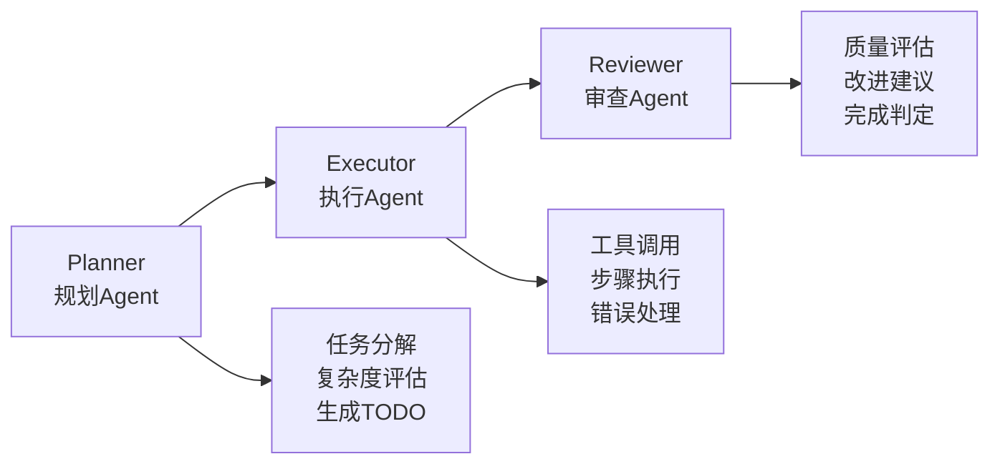
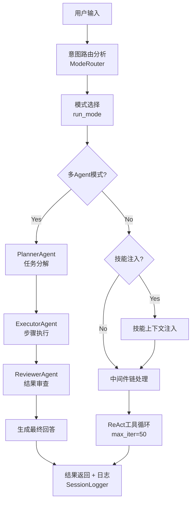
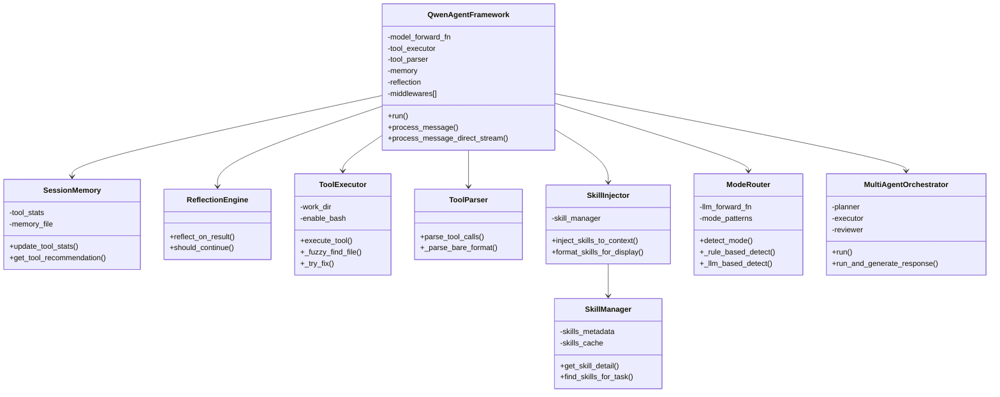

# QwenAgentFramework 项目完整理解文档

> 版本: 1.0  
> 作者: AI Assistant  
> 日期: 2026-03-28

## 目录
1. [项目概述](#1-项目概述)
2. [核心架构设计](#2-核心架构设计)
3. [模块详解](#3-模块详解)
4. [执行流程分析](#4-执行流程分析)
5. [关键技术点](#5-关键技术点)
6. [设计哲学](#6-设计哲学)
7. [附录: 核心类图](#附录-核心类图)

---

## 1. 项目概述

### 1.1 项目定位
**QwenAgentFramework** 是一个专为 **Qwen2.5-0.5B** 本地模型设计的智能Agent框架，采用 **ReAct (Reasoning + Acting)** 模式，实现了完整的工具调用、技能系统、多Agent协作和意图路由能力。

### 1.2 核心特性矩阵
| 特性 | 实现方式 | 创新点 |
| :--- | :--- | :--- |
| **ReAct 循环** | Thought -> Action -> Observation -> Reflection | 支持并行工具执行 |
| **工具系统** | bash/read_file/write_file/edit_file/list_dir | 智能重试 + 模糊路径搜索 |
| **技能系统** | 渐进式披露 (元数据->详细内容->资源) | 作为工具结果注入，保留缓存 |
| **意图路由** | 双层路由：规则路由 + LLM语义路由 | 自动模式切换 |
| **多Agent协作** | Planner + Executor + Reviewer | 任务拆解与质量审查 |
| **持久化记忆** | SessionMemory + VectorMemory | 跨会话工具统计 |
| **流式输出** | SSE实时展示执行进度 | 事件驱动架构 |

### 1.3 项目结构
```
core/
├── __init__.py                 # 模块入口，导出所有公共API
├── agent_framework.py          # 核心框架：QwenAgentFramework
├── agent_middlewares.py        # 13个中间件 + 基类
├── agent_tools.py              # 工具执行器 + 解析器 + 注册表
├── agent_skills.py             # 技能管理器 + 注入器
├── mode_router.py              # 双层意图路由器
├── multi_agent.py              # 多Agent协调器
├── streaming_framework.py      # 流式输出框架
├── tool_learner.py             # 工具学习系统
├── tool_enforcement_middleware.py  # 工具强制调用中间件
├── vector_memory.py            # 向量记忆系统
├── prompts.py                  # 系统提示词模板
└── web_agent_with_skills.py    # Gradio Web UI
```

---

## 2. 核心架构设计

### 2.1 ReAct 模式实现


**核心代码实现** (`agent_framework.py:run` 方法):
```python
def run(self, user_input, history=None, runtime_context=None):
    messages = self._build_messages(user_input, history)
    
    for iteration in range(self.max_iterations):
        # 1. Thought: 调用模型生成思考
        response = self.model_forward_fn(messages, self.system_prompt)
        
        # 2. Action: 解析并执行工具
        tool_calls = self.tool_parser.parse_tool_calls(response)
        results = self._execute_tools(tool_calls)
        
        # 3. Observation: 格式化结果
        observation = self._format_results(results)
        
        # 4. Reflection: 反思引擎分析
        if self.reflection:
            reflection = self.reflection.reflect_on_result(tool_name, result)
```

### 2.2 中间件链设计 (Middleware Chain)
借鉴 **DeerFlow** 的中间件设计模式，实现 **AOP (面向切面编程)** 风格的上下文注入。

```mermaid
flowchart LR
    subgraph 请求流程
        A[User Input] --> B[Middleware1<br/>(RuntimeMode)]
        B --> C[Middleware2<br/>(PlanMode)]
        C --> D[LLM]
    end
    subgraph 响应流程
        D --> E[Middleware4<br/>(Summary)]
        E --> F[Middleware3<br/>(ToolGuard)]
        F --> G[User Output]
    end
```

**核心中间件列表**:
| 中间件 | 职责 | 执行时机 | 设计亮点 |
| :--- | :--- | :--- | :--- |
| `RuntimeModeMiddleware` | 注入运行模式提示 | before_model | 支持chat/tools/skills/hybrid |
| `PlanModeMiddleware` | 注入计划模式约束 | before_model | 工具模式下调整提示策略 |
| `SkillsContextMiddleware` | 注入技能上下文 | before_model | 渐进式披露 |
| `UploadedFilesMiddleware` | 注入上传文件元数据 | before_model | 支持PDF处理 |
| `ToolResultGuardMiddleware` | 标准化工具结果 | after_tool_call | 统一JSON结构 |
| `TodoContextMiddleware` | 任务状态追踪 | before_model | 上下文丢失检测 |
| `ConversationSummaryMiddleware` | 对话压缩 | before_model | LLM语义摘要+规则摘要 |
| `CompletenessMiddleware` | 完整性原则 | before_model | gstack Boil the Lake哲学 |
| `AskUserQuestionMiddleware` | 结构化提问格式 | after_model | Re-ground/Simplify/Recommend/Options |
| `CompletionStatusMiddleware` | 完成状态协议 | before_model | DONE/BLOCKED/NEEDS_CONTEXT |
| `SearchBeforeBuildingMiddleware` | 搜索优先原则 | before_model | 三层知识体系 |
| `RepoOwnershipMiddleware` | 仓库所有权模式 | before_model | solo/collaborative/unknown |

### 2.3 双层意图路由系统
```mermaid
flowchart TD
    A[用户输入] --> B[规则路由<br/>(快速:正则+关键词匹配)]
    B --> C{置信度 >= 0.70?}
    C -->|Yes| D[返回匹配结果]
    C -->|No| E[LLM语义路由<br/>(精确:语义理解)]
    E --> D
```

**模式映射关系**:
| 检测模式 | 映射运行模式 | 触发条件 |
| :--- | :--- | :--- |
| `chat` | chat | 闲聊、知识问答 |
| `tools` | tools | 文件操作、命令执行 |
| `skills` | skills | 使用外部知识库 |
| `hybrid` | hybrid | 技能+工具结合 |
| `plan` | tools + plan_mode=True | 复杂任务拆解 |
| `multi_agent` | multi_agent | 规划-执行-审查 |
| `streaming` | tools + streaming | 实时进度展示 |

---

## 3. 模块详解

### 3.1 agent_framework.py - 核心引擎

#### 3.1.1 SessionMemory - 持久化会话记忆
```python
class SessionMemory:
    """会话记忆 + 工具使用统计 + 持久化"""
    
    def __init__(self, memory_dir: str = ".agent_memory"):
        self.tool_stats = defaultdict(lambda: {"success": 0, "failed": 0, "avg_time": 0})
        self.memory_file = self.memory_dir / "session_memory.pkl"
        self._load_from_disk()  # 启动时恢复
        
    def update_tool_stats(self, tool_name: str, success: bool, exec_time: float):
        """更新工具成功率统计，用于后续推荐"""
        
    def get_tool_recommendation(self, task_type: str) -> List[str]:
        """基于历史推荐工具：按成功率排序"""
```

**设计亮点**:
- 使用 **pickle** 持久化，支持复杂Python对象
- 工具成功率统计实现 **反馈学习**
- 跨会话记忆保留最近3次会话的关键信息

#### 3.1.2 ReflectionEngine - 反思引擎
```python
class ReflectionEngine:
    """ReAct 模式的反思组件"""
    
    @staticmethod
    def reflect_on_result(tool_name: str, result: Dict, expected: str = None) -> Dict:
        """
        反思工具执行结果，返回:
        - success: 是否成功
        - analysis: 错误分类分析
        - suggestions: 改进建议列表
        """
        
    @staticmethod
    def should_continue(history: List[Dict], max_failed: int = 3) -> Tuple[bool, str]:
        """判断是否应该继续（连续失败检测）"""
```

**错误分类策略**:
| 错误类型 | 检测关键词 | 建议策略 |
| :--- | :--- | :--- |
| 文件不存在 | "not found" | 使用list_dir确认路径 |
| 权限不足 | "permission" | 检查文件权限 |
| 语法错误 | "syntax", "invalid" | 检查参数格式 |
| 未知错误 | 其他 | 换用其他工具 |

#### 3.1.3 智能上下文压缩
```python
def _compress_context_smart(self, messages: List[Dict], limit=6000) -> List[Dict]:
    """智能压缩 - 基于语义重要性保留关键消息"""
    
    # 1. 计算消息重要性（关键词密度 + 角色权重）
    scores = self.memory.compute_message_importance(messages)
    
    # 2. 保留最近6条完整消息
    recent = user_assistant[-6:]
    
    # 3. 旧消息按重要性排序，保留top-3
    important_msgs = [msg for msg, _ in scored_msgs[:3]]
    
    # 4. 生成历史摘要
    summary_text = self.memory.build_context_summary(old)
```

**重要性计算算法**:
```python
def compute_message_importance(self, messages: List[Dict]) -> List[float]:
    keywords = ["error", "failed", "success", "file", "path", "tool", "result"]
    
    for msg in messages:
        content = msg.get("content", "").lower()
        # 基于关键词密度
        score = sum(1 for kw in keywords if kw in content)
        # 用户消息权重更高
        if msg.get("role") == "user":
            score *= 1.5
        # 工具结果权重更高
        if "✅" in content or "❌" in content:
            score *= 1.3
        scores.append(score)
```

### 3.2 agent_tools.py - 工具系统

#### 3.2.1 模糊路径搜索策略
```python
def _fuzzy_find_file(self, filename: str, search_home: bool = True) -> Optional[Path]:
    """
    三级模糊搜索策略:
    1. 在 work_dir 递归搜索（速度快，最优先）
    2. 在用户家目录递归搜索（若search_home=True）
    3. 返回 None，调用方提示用户
    
    跳过: .git, __pycache__, node_modules, .venv 等
    """
    SKIP_DIRS = {
        ".git", "__pycache__", "node_modules", ".venv", "venv",
        ".tox", "dist", "build", ".mypy_cache", ".pytest_cache"
    }
```

**路径解析优先级**:
1. **绝对路径**: 直接使用，不做模糊搜索
2. **相对路径拼接**: `work_dir / path`
3. **直接路径尝试**: 检查文件是否存在
4. **模糊搜索**: 递归搜索文件名匹配
5. **错误提示**: 提供详细的搜索失败信息

#### 3.2.2 工具调用解析器 (ToolParser)
支持 **8种格式** 的工具调用:
| 格式 | 示例 | 适用场景 |
| :--- | :--- | :--- |
| XML标记 | `<tool>bash</tool><input>{"cmd":"ls"}</input>` | 标准格式 |
| JSON数组 | `[{"tool":"bash","input":{"cmd":"ls"}}]` | 批量调用 |
| JSON对象 | `{"tool":"bash","input":{"cmd":"ls"}}` | 单工具调用 |
| function_call | `{"name":"bash","arguments":{"cmd":"ls"}}` | OpenAI兼容 |
| Markdown代码块 | ```json\n{"tool":"bash"...}\n``` | 模型常见输出 |
| 工具名+代码块 | `bash\n```json\n{"cmd":"ls"}\n```` | GLM风格 |
| 裸格式 | `bash\n{"cmd":"ls"}` | 简化格式 |
| 单行混合 | `执行命令：bash\n{"cmd":"ls"}` | 自然语言+工具 |

**容错策略**:
```python
@staticmethod
def _parse_input_payload(input_str: str) -> Optional[Dict[str, Any]]:
    """解析工具输入，容忍轻微 JSON 格式问题"""
    
    # 策略1: 直接 json.loads
    try:
        return json.loads(payload)
    except:
        pass
    
    # 策略2: 补齐缺失右括号
    if missing_right_brace > 0:
        repaired = payload + ("}" * missing_right_brace)
        
    # 策略3: 修复非法 JSON 转义序列（\\s \\; \\( 等）
    # 将非法转义替换为双反斜杠
```

#### 3.2.3 工具注册表 (ToolRegistry)
借鉴 **DeerFlow** 的插件化设计:
```python
class ToolRegistry:
    """工具注册表：支持动态注册自定义工具"""
    
    def register(self, name: str, description: str, 
                 input_schema: Dict, handler, enabled: bool = True):
        """注册自定义工具"""
        
    def execute(self, tool_name: str, tool_input: Dict) -> Optional[str]:
        """执行注册的工具"""
```

**设计哲学**: 内置工具由 ToolExecutor 管理，扩展工具通过 ToolRegistry 动态注册，实现 **开放封闭原则**。

### 3.3 agent_skills.py - 技能系统

#### 3.3.1 渐进式披露架构
```mermaid
flowchart TD
    A[第1层: 元数据<br/>(始终加载)] --> B[name: 技能名称]
    A --> C[description: 功能描述]
    A --> D[tags: 分类标签]
    E[第2层: 详细内容<br/>(按需加载)] --> F[SKILL.md 完整内容]
    G[第3层: 资源文件<br/>(需要时加载)] --> H[scripts/ 可执行脚本]
    G --> I[references/ 参考文档]
```

**缓存友好注入策略**:
```python
def inject_skills_to_context(self, messages, relevant_skills, include_full_content=False):
    """
    关键洞察: 技能作为工具结果 (用户消息) 注入,
    而不是系统提示词。这保留了提示词缓存!
    
    错误: 编辑系统提示词 (缓存失效)
    正确: 添加工具结果 (缓存命中) ✅
    """
    skill_injection_msg = {
        "role": "user",  # 作为用户消息，不是system
        "content": f"[可用技能]\n\n{skills_context}"
    }
    # 插入到最后一个用户消息之前
    updated_messages.insert(-1, skill_injection_msg)
```

#### 3.3.2 SKILL.md 格式规范
```markdown
---
name: PDF 处理
description: 使用 pdftotext 或 PyMuPDF 处理 PDF 文件
tags: [pdf, document, parsing, extraction]
license: MIT
resources:
  - references/pdf_spec.md
  - scripts/extract.py
---

# PDF 处理技能

## 概述
处理 PDF 文件的系统性方法...

## 最佳实践
1. **文本提取工具选择**: ...

## 命令示例
```bash
pdftotext input.pdf output.txt
```
```

### 3.4 multi_agent.py - 多Agent协作

#### 3.4.1 Planner-Executor-Reviewer 架构


**PlannerAgent 实现**:
```python
def plan(self, user_input: str, context: Optional[Dict] = None) -> Dict:
    """生成执行计划，返回严格JSON格式"""
    system_prompt = """你是任务规划助手。将用户需求分解为2-4个具体步骤。
    
    返回格式（严格 JSON）：
    {
      "complexity": "simple|medium|complex",
      "steps": [
        {"id": 1, "action": "步骤描述", "tool": "可用工具之一"},
        {"id": 2, "action": "步骤描述", "tool": "none"}
      ]
    }
    """
```

**ExecutorAgent 工具参数提取**:
```python
def _extract_tool_args(self, action: str, tool: str) -> Dict[str, str]:
    """
    五级参数提取策略:
    1. 匹配带扩展名的文件名 (api.md, config.py)
    2. 匹配引号内的内容
    3. 匹配关键词后的内容
    4. 匹配相对路径
    5. 匹配中文动词后的内容
    """
```

#### 3.4.2 跨轮记忆机制
```python
def run(self, user_input: str, context: Optional[Dict] = None) -> Dict:
    """
    支持跨轮任务进度记忆:
    - completed_steps: 上一轮已完成的步骤列表
    - previous_task: 上一轮的任务描述
    - files_touched: 已操作的文件路径列表
    - current_task: 当前任务标识
    """
    plan_context = {
        "completed_steps": context.get("completed_steps", []),
        "previous_task": context.get("previous_task"),
        "files_touched": context.get("files_touched", []),
        "current_task": context.get("current_task", "")
    }
```

### 3.5 mode_router.py - 双层意图路由

#### 3.5.1 规则路由实现
```python
def _rule_based_detect(self, user_input: str, context: Optional[Dict] = None) -> Dict:
    # 0. 直接命令检测（最高优先级）
    direct_cmd = DirectCommandDetector.detect(user_input)
    
    # 1. 路径强信号先行判断
    if self._PATH_PATTERN.search(user_input):
        return {"recommended_mode": "tools", "confidence": 0.92}
    
    # 2. 关键词匹配计分
    for mode, pattern in self.mode_patterns.items():
        match_count = sum(1 for kw in keywords if kw in user_input_lower)
        score = match_count * priority
```

#### 3.5.2 LLM语义路由
```python
def _llm_based_detect(self, user_input: str, context: Optional[Dict] = None) -> Optional[Dict]:
    """
    LLM意图路由系统提示:
    - 背景重申 (Re-ground)
    - 简化说明 (Simplify)
    - 推荐模式 (Recommend)
    - 选项展示 (Options)
    """
    SUMMARY_SYSTEM = """你是意图路由专家...
    
    分析指南：
    1. 如果用户提到"看看"、"读读"、"文件" -> 路由到 tools
    2. 如果用户说"帮我写"、"设计一个" -> 路由到 plan
    3. 如果用户问"什么是"、"为什么" -> 路由到 chat
    
    输出格式: {"mode": "tools", "confidence": 0.9, "reason": "..."}
    """
```

#### 3.5.3 追问上下文继承
```python
def analyze(self, user_message, uploaded_files=None, chat_history=None):
    # 追问继承：检测"之前/上次/刚才"等关键词
    _followup_patterns = re.compile(
        r'(之前|上次|刚才|刚刚|上一轮|上一条|查看|回顾|总结|再说一遍|'
        r'什么问题|聊过什么|聊了什么|问过什么|说了什么|记录|历史|'
        r'前面|那个|之前说|你刚|you said|previous|last|above)'
    )
    
    # 若检测到追问，注入上一轮工具执行结果摘要
    if _is_followup and chat_history:
        inherited_context = self._extract_history_summary(chat_history)
```

---

## 4. 执行流程分析

### 4.1 完整请求处理流程


### 4.2 ReAct 循环详细流程
```python
# 伪代码展示单次迭代
for iteration in range(max_iterations):
    # 1. 上下文管理
    messages = _compress_context_smart(messages)      # 智能压缩
    messages = _inject_task_context(messages)         # 注入任务进度
    messages = _inject_reflection(messages)           # 注入反思建议
    
    # 2. 中间件预处理
    for mw in middlewares:
        messages = mw.process_before_llm(messages, runtime_context)
    
    # 3. 模型调用
    response = model_forward_fn(messages, system_prompt)
    
    # 4. 工具解析
    tool_calls = tool_parser.parse_tool_calls(response)
    
    if not tool_calls:
        # 无工具调用 -> 任务完成
        break
    
    # 5. 并行/串行执行
    parallel_tools, sequential_tools = _detect_parallel_tools(tool_calls)
    parallel_results = _execute_tools_parallel(parallel_tools)
    sequential_results = [_execute_single_tool(tc) for tc in sequential_tools]
    
    # 6. 结果格式化 + 反思
    observation = _format_results(results)
    reflection = reflection_engine.reflect_on_result(tool_name, result)
    
    # 7. 循环检测
    if _detect_loop():  # 3次相同失败自动中断
        break
    
    # 8. 回注结果，进入下一轮
    messages.append({"role": "assistant", "content": response})
    messages.append({"role": "user", "content": observation})
```

---

## 5. 关键技术点

### 5.1 并行工具执行
```python
def _detect_parallel_tools(self, tool_calls: List[Dict]) -> Tuple[List[Dict], List[Dict]]:
    """检测可并行执行的工具"""
    parallel_tools = []
    sequential_tools = []
    
    for tc in tool_calls:
        # 只读工具可并行（无状态副作用）
        if tc["name"] in ["read_file", "list_dir"]:
            parallel_tools.append(tc)
        else:
            # 写入工具必须串行（避免竞态条件）
            sequential_tools.append(tc)
    
    return parallel_tools, sequential_tools

def _execute_tools_parallel(self, tool_calls: List[Dict]) -> List[Dict]:
    """使用 ThreadPoolExecutor 并行执行"""
    with ThreadPoolExecutor(max_workers=3) as executor:
        futures = {executor.submit(_execute_single_tool, tc): tc 
                  for tc in tool_calls}
        for future in as_completed(futures):
            result = future.result()
```

**设计原理**: 基于 **读写分离** 原则，只读操作无状态副作用，可安全并行；写入操作可能产生竞态条件，必须串行。

### 5.2 智能重试机制
```python
def _try_fix(self, tool: str, args: Dict, error: str) -> Optional[Dict]:
    """智能重试：自动修复常见错误"""
    
    # 场景1: grep 转义问题
    if tool == "bash" and "grep" in args.get("command", ""):
        cmd = args["command"]
        if "\\(" in cmd and "\\\\(" not in cmd:
            return {"command": cmd.replace("\\(", "(")}
    
    # 场景2: 路径补全
    if tool in ["read_file", "edit_file"] and "not found" in error.lower():
        path = args.get("path", "")
        if not path.startswith("/") and not path.startswith("."):
            return {"path": f"./{path}"}
    
    return None  # 无法自动修复
```

### 5.3 循环检测机制
```python
def _detect_loop(self, max_same=3) -> bool:
    """多层次循环检测"""
    
    # 检测1: 连续 max_same 次相同调用
    if len(self.tool_history) >= max_same:
        recent = self.tool_history[-max_same:]
        if all(h["tool"] == recent[0]["tool"] and 
               h["args"] == recent[0]["args"] for h in recent):
            return True
    
    # 检测2: 全局累计相同调用超过5次（防止极端死循环）
    _call_counts = {}
    for h in self.tool_history:
        key = f"{h['tool']}|{h['args']}"
        _call_counts[key] = _call_counts.get(key, 0) + 1
    if any(cnt >= 5 for cnt in _call_counts.values()):
        return True
    
    return False
```

### 5.4 向量记忆实现
使用 **TF-IDF** 作为简化版 embedding:
```python
class VectorMemory:
    def _compute_embedding(self, text: str) -> List[float]:
        """计算文本的 TF-IDF embedding"""
        tokens = self._tokenize(text)
        tf = self._compute_tf(tokens)
        
        # 构建向量
        embedding = [0.0] * len(self.vocabulary)
        for token, tf_value in tf.items():
            if token in self.vocabulary:
                idx = self.vocabulary[token]
                idf_value = self.idf.get(token, 1.0)
                embedding[idx] = tf_value * idf_value
        
        # L2 归一化
        norm = math.sqrt(sum(x * x for x in embedding))
        if norm > 0:
            embedding = [x / norm for x in embedding]
        
        return embedding
    
    def search(self, query: str, top_k: int = 3) -> List[Dict]:
        """语义检索：基于余弦相似度"""
        query_emb = self._compute_embedding(query)
        similarities = [
            (i, self._cosine_similarity(query_emb, emb))
            for i, emb in enumerate(self.embeddings)
        ]
        similarities.sort(key=lambda x: x[1], reverse=True)
        return [self.memories[i] for i, _ in similarities[:top_k]]
```

---

## 6. 设计哲学

### 6.1 核心设计原则
| 原则 | 实现方式 | 示例 |
| :--- | :--- | :--- |
| **渐进式披露** | 技能系统三层加载 | 元数据->详细内容->资源文件 |
| **缓存友好** | 技能作为用户消息注入 | 不修改system prompt |
| **防御性编程** | 8种工具格式解析 + 智能重试 | 兼容GLM/Qwen不同输出风格 |
| **反馈学习** | ToolLearner记录成功率 | 基于历史推荐工具 |
| **可观测性** | SessionLogger完整记录 | 执行日志 + 模型调用日志 |
| **优雅降级** | 工具模式失败->对话模式 | 异常捕获 + 模式切换 |

### 6.2 与主流框架的差异化
```
┌─────────────────────────────────────────────────────────────┐
│                    架构定位对比                            │
├─────────────────────────────────────────────────────────────┤
│                                                             │
│  LangChain: 通用框架，强调生态集成                           │
│     └── 抽象层级高，学习曲线陡峭                             │
│                                                             │
│  LangGraph: 工作流引擎，强调状态机                            │
│     └── 图结构编排，适合复杂流程                             │
│                                                             │
│  QwenAgentFramework: 垂直优化，强调本地模型适配                │
│     └── 为 Qwen2.5-0.5B 量身定制                            │
│     └── 双层意图路由 + 渐进式技能系统                         │
│     └── 完整的工具容错 + 智能重试                            │
│                                                             │
└─────────────────────────────────────────────────────────────┘
```

### 6.3 关键技术决策

**决策1: 为什么使用 pickle 而不是 JSON 持久化？**
```python
# 选择 pickle 的原因:
# 1. 支持复杂 Python 对象（defaultdict, datetime 等）
# 2. 无需自定义序列化逻辑
# 3. 读写速度快
# 
# 权衡: 非人类可读，但 SessionMemory 是内部实现细节
```

**决策2: 为什么使用 TF-IDF 而不是外部 embedding 模型？**
```python
# 选择 TF-IDF 的原因:
# 1. 零外部依赖，无需下载模型
# 2. CPU 计算快，适合本地运行
# 3. 对于短文本检索效果足够
# 
# 权衡: 语义理解能力弱于神经网络，但可通过关键词密度补偿
```

**决策3: 为什么采用中间件链而不是装饰器？**
```python
# 选择中间件链的原因:
# 1. 支持动态增删中间件
# 2. 统一的 before/after 钩子接口
# 3. 便于测试和替换单个中间件
# 
# 权衡: 比装饰器稍复杂，但更灵活
```

---

## 附录: 核心类图


---

> **文档结束** - 本框架完整实现了从意图识别到工具执行、从单Agent到多Agent协作、从同步到流式的全链路能力，专为本地小模型场景优化设计。

---

